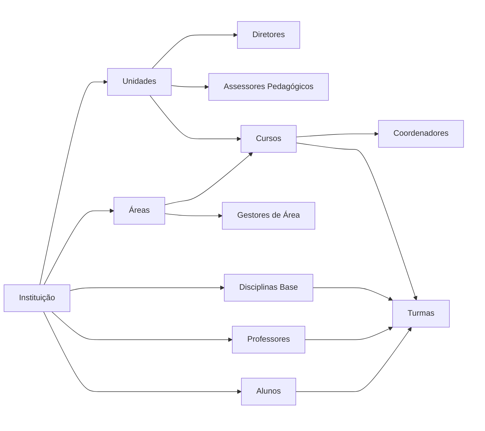
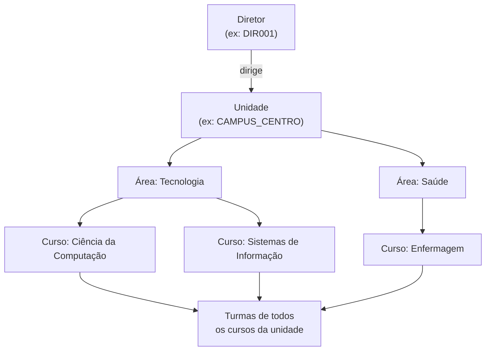
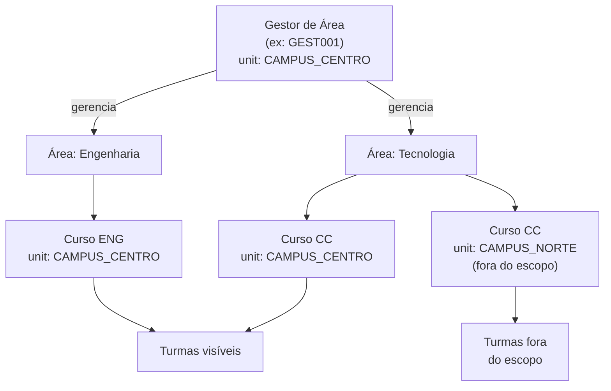
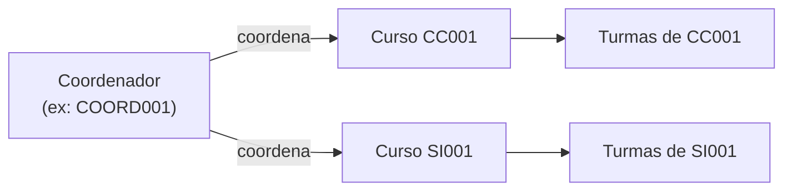
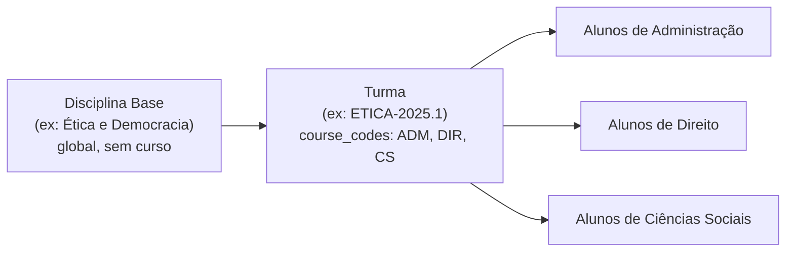
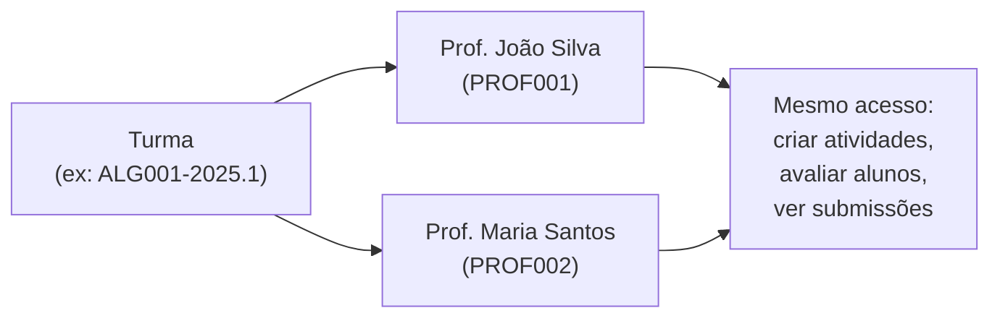
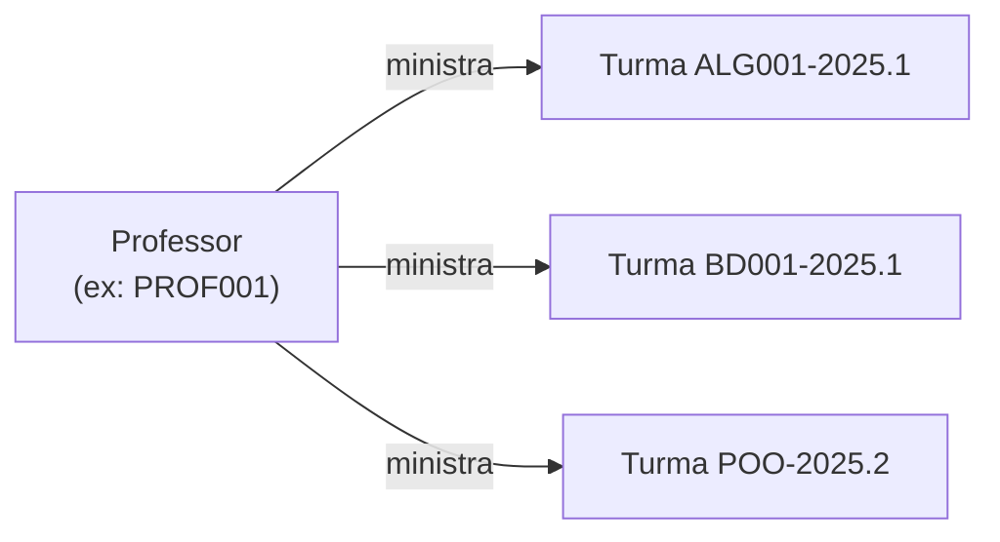
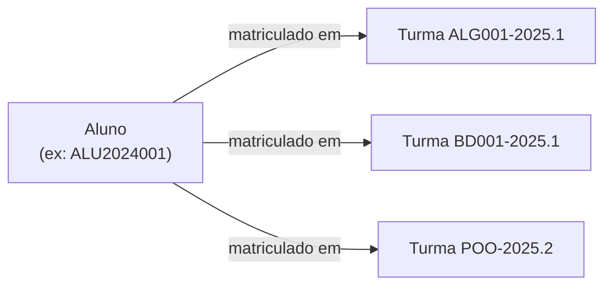
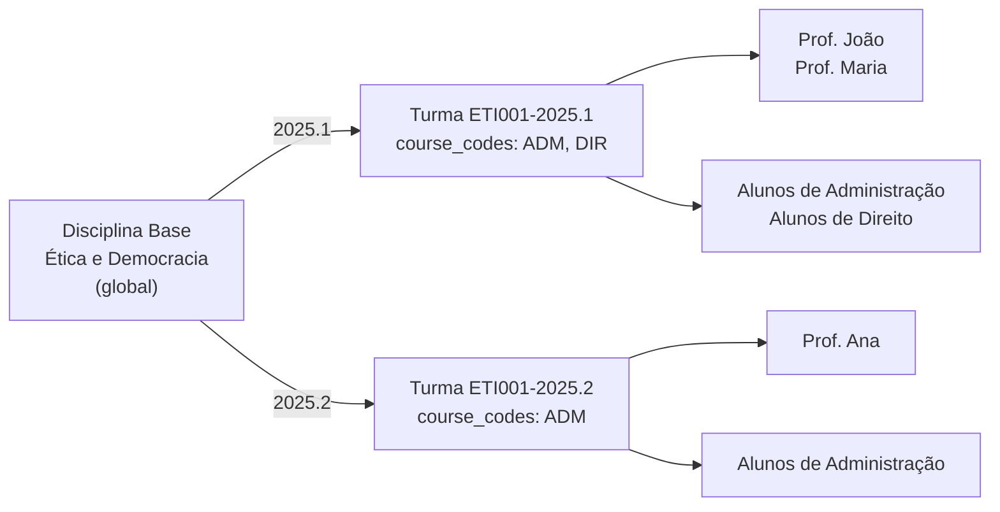

# Conceitos Fundamentais

## Introdução

Este documento detalha as entidades do sistema de integração ProExtend e seus relacionamentos.

## Modelo de Dados

### Hierarquia de Entidades



:::note
Áreas e Disciplinas Base são entidades **globais da instituição**: não pertencem a uma unidade ou curso específico. O vínculo entre Curso e Área (e entre Curso e Unidade) acontece no próprio Curso. O vínculo entre Curso e Disciplina acontece na Turma (via `course_codes`).
:::

## Entidades Detalhadas

### 1. Unidade (Unit)

Campus ou unidade física da instituição.

#### Atributos

<Attributes>
  <Attr name="code" type="string" required>Identificador único do sistema de origem (ERP). Usado em todas as entidades para mapeamento idempotente. Exemplo: `CAMPUS_CENTRO`, `SEDE`</Attr>
  <Attr name="name" type="string" required>Nome da unidade</Attr>
  <Attr name="address" type="string" required={false}>Endereço completo</Attr>
</Attributes>

#### Exemplo

```json
{
  "code": "CAMPUS_CENTRO",
  "name": "Campus Centro",
  "address": "Rua Principal, 123 - Centro, São Paulo - SP"
}
```

#### Características

- Não depende de outras entidades
- Possui Diretores (Directors), Assessores Pedagógicos (Pedagogical Advisors), Áreas (Areas) e Cursos (Courses) vinculados

---

### 2. Diretor (Director)

Diretor de unidade, responsável pela gestão de um campus.

#### Atributos

<Attributes>
  <Attr name="code" type="string" required>Código único do diretor</Attr>
  <Attr name="name" type="string" required>Nome completo</Attr>
  <Attr name="email" type="string" required>Email institucional (único)</Attr>
  <Attr name="cpf" type="string" required={false}>CPF: apenas 11 dígitos sem formatação, ex: `12345678901`</Attr>
  <Attr name="phone" type="string" required={false}>Telefone: apenas dígitos, 10 a 11 caracteres</Attr>
  <Attr name="unit_code" type="string" required>Código da unidade que dirige (deve existir)</Attr>
  <Attr name="active" type="boolean" required={false}>
    Controla o status:
    <AttrValues>
      <AttrValue value="true">reativa (remove suspensão)</AttrValue>
      <AttrValue value="false">suspende</AttrValue>
      <AttrValue value="omitir">não altera o status atual</AttrValue>
    </AttrValues>
  </Attr>
</Attributes>

#### Exemplo

```json
{
  "code": "DIR001",
  "name": "Roberto Lima",
  "email": "roberto.lima@faculdade.edu.br",
  "unit_code": "CAMPUS_CENTRO"
}
```

#### Características

- **Depende de**: Unidade (Unit)
- Sistema cria credenciais de acesso automaticamente
- Pode ser suspenso sem ser removido via campo `active: false`

O Diretor tem visibilidade sobre todas as turmas da sua unidade. Como a unidade agrupa áreas, e cada área agrupa cursos, o acesso percorre toda essa hierarquia: qualquer turma vinculada a um curso de qualquer área da unidade estará visível.



---

### 3. Assessor Pedagógico (Pedagogical Advisor)

Assessor responsável pelo suporte pedagógico em uma unidade.

#### Atributos

<Attributes>
  <Attr name="code" type="string" required>Código único do assessor</Attr>
  <Attr name="name" type="string" required>Nome completo</Attr>
  <Attr name="email" type="string" required>Email institucional (único)</Attr>
  <Attr name="cpf" type="string" required={false}>CPF: apenas 11 dígitos sem formatação, ex: `12345678901`</Attr>
  <Attr name="phone" type="string" required={false}>Telefone: apenas dígitos, 10 a 11 caracteres</Attr>
  <Attr name="unit_code" type="string" required>Código da unidade de atuação (deve existir)</Attr>
  <Attr name="active" type="boolean" required={false}>
    Controla o status:
    <AttrValues>
      <AttrValue value="true">reativa (remove suspensão)</AttrValue>
      <AttrValue value="false">suspende</AttrValue>
      <AttrValue value="omitir">não altera o status atual</AttrValue>
    </AttrValues>
  </Attr>
</Attributes>

#### Exemplo

```json
{
  "code": "ASSES001",
  "name": "Fernanda Costa",
  "email": "fernanda.costa@faculdade.edu.br",
  "unit_code": "CAMPUS_CENTRO"
}
```

#### Características

- **Depende de**: Unidade (Unit)
- Sistema cria credenciais de acesso automaticamente
- Pode ser suspenso sem ser removido via campo `active: false`

O Assessor Pedagógico tem a mesma visibilidade de turmas que o Diretor (Director): acesso a todas as turmas de todos os cursos e áreas da unidade. A diferença está no papel dentro da instituição, não no escopo de acesso à plataforma.

---

### 4. Área (Area)

Área de conhecimento que agrupa cursos relacionados.

#### Atributos

<Attributes>
  <Attr name="code" type="string" required>Código único da área. Exemplo: `TECH`, `HEALTH`</Attr>
  <Attr name="name" type="string" required>Nome da área</Attr>
</Attributes>

#### Exemplo

```json
{
  "code": "TECH",
  "name": "Tecnologia da Informação"
}
```

#### Características

- Não depende de outras entidades: é uma entidade **global da instituição**
- O vínculo com unidade acontece através do curso (cada curso indica sua unidade via `unit_code`)
- Possui Gestores de Área (Area Managers) e Cursos (Courses) vinculados

---

### 5. Gestor de Área (Area Manager)

Gestor responsável por uma ou mais áreas de conhecimento, com escopo restrito a uma unidade.

#### Atributos

<Attributes>
  <Attr name="code" type="string" required>Código único do gestor</Attr>
  <Attr name="name" type="string" required>Nome completo</Attr>
  <Attr name="email" type="string" required>Email institucional (único)</Attr>
  <Attr name="cpf" type="string" required={false}>CPF: apenas 11 dígitos sem formatação, ex: `12345678901`</Attr>
  <Attr name="phone" type="string" required={false}>Telefone: apenas dígitos, 10 a 11 caracteres</Attr>
  <Attr name="area_codes" type="array" required>Códigos das áreas que gerencia (mínimo 1)</Attr>
  <Attr name="area_sync_mode" type="string" required={false}>
    Modo de sincronização de áreas (padrão: `replace`). Comportamento detalhado em [Fluxo de Sincronização - Modos de sincronização](fluxo-de-sincronizacao#modos-de-sincronização-add-vs-replace):
    <AttrValues>
      <AttrValue value="add">preserva os vínculos existentes e adiciona os novos</AttrValue>
      <AttrValue value="replace">substitui pelos enviados</AttrValue>
    </AttrValues>
  </Attr>
  <Attr name="unit_code" type="string" required>Código da unidade do gestor (deve existir). Restringe o escopo às turmas da unidade</Attr>
  <Attr name="active" type="boolean" required={false}>
    Controla o status:
    <AttrValues>
      <AttrValue value="true">reativa (remove suspensão)</AttrValue>
      <AttrValue value="false">suspende</AttrValue>
      <AttrValue value="omitir">não altera o status atual</AttrValue>
    </AttrValues>
  </Attr>
</Attributes>

#### Exemplo

```json
{
  "code": "GEST001",
  "name": "Carlos Mendes",
  "email": "carlos.mendes@faculdade.edu.br",
  "area_codes": ["TECH", "ENG"],
  "unit_code": "CAMPUS_CENTRO"
}
```

#### Características

- **Depende de**: Áreas (Areas) e Unidade (Unit)
- Sistema cria credenciais de acesso automaticamente
- Pode ser suspenso sem ser removido via campo `active: false`

O Gestor de Área tem visibilidade sobre todas as turmas dos cursos pertencentes às áreas que gerencia, **restritas à sua unidade**. Como a área é global da instituição, sem `unit_code` o gestor veria turmas da mesma área em qualquer campus. Por isso a unidade é obrigatória e funciona como filtro de escopo.



---

### 6. Curso (Course)

Curso de graduação ou pós-graduação oferecido pela instituição.

#### Atributos

<Attributes>
  <Attr name="code" type="string" required>Código único do curso. Exemplo: `CC001`, `ENF001`</Attr>
  <Attr name="name" type="string" required>Nome do curso</Attr>
  <Attr name="description" type="string" required={false}>Descrição detalhada</Attr>
  <Attr name="area_code" type="string" required>Código da área (deve existir)</Attr>
  <Attr name="unit_code" type="string" required>Código da unidade (deve existir)</Attr>
</Attributes>

#### Exemplo

```json
{
  "code": "CC001",
  "name": "Ciência da Computação",
  "description": "Bacharelado em Ciência da Computação - Duração 4 anos",
  "area_code": "TECH",
  "unit_code": "CAMPUS_CENTRO"
}
```

#### Características

- **Depende de**: Unidade (Unit) e Área (Area)
- Possui Coordenadores (Coordinators) e Disciplinas Base (Subjects) vinculadas

---

### 7. Coordenador (Coordinator)

Coordenador de um ou mais cursos, responsável pela gestão acadêmica.

#### Atributos

<Attributes>
  <Attr name="code" type="string" required>Código único do coordenador</Attr>
  <Attr name="name" type="string" required>Nome completo</Attr>
  <Attr name="email" type="string" required>Email institucional (único)</Attr>
  <Attr name="cpf" type="string" required={false}>CPF: apenas 11 dígitos sem formatação, ex: `12345678901`</Attr>
  <Attr name="phone" type="string" required={false}>Telefone: apenas dígitos, 10 a 11 caracteres</Attr>
  <Attr name="course_codes" type="array" required>Códigos dos cursos que coordena (mínimo 1)</Attr>
  <Attr name="course_sync_mode" type="string" required={false}>
    Modo de sincronização de cursos (padrão: `replace`). Comportamento detalhado em [Fluxo de Sincronização - Modos de sincronização](fluxo-de-sincronizacao#modos-de-sincronização-add-vs-replace):
    <AttrValues>
      <AttrValue value="add">preserva os vínculos existentes e adiciona os novos</AttrValue>
      <AttrValue value="replace">substitui pelos enviados</AttrValue>
    </AttrValues>
  </Attr>
  <Attr name="active" type="boolean" required={false}>
    Controla o status:
    <AttrValues>
      <AttrValue value="true">reativa (remove suspensão)</AttrValue>
      <AttrValue value="false">suspende</AttrValue>
      <AttrValue value="omitir">não altera o status atual</AttrValue>
    </AttrValues>
  </Attr>
</Attributes>

#### Exemplo

```json
{
  "code": "COORD001",
  "name": "Prof. Ana Souza",
  "email": "ana.souza@faculdade.edu.br",
  "cpf": "11122233344",
  "phone": "11988887777",
  "course_codes": ["CC001", "SI001"]
}
```

#### Características

- **Depende de**: Cursos (Courses)
- Sistema cria credenciais de acesso automaticamente
- Pode ser suspenso sem ser removido via campo `active: false`

O Coordenador tem visibilidade sobre todas as turmas dos cursos que coordena. Um coordenador pode coordenar mais de um curso e enxerga as turmas de todos eles. Turmas de cursos não coordenados não são acessíveis, mesmo que compartilhem disciplinas via `course_codes`.



---

### 8. Disciplina Base (Subject)

Componente curricular do catálogo da instituição. A mesma disciplina base pode ser usada por turmas de cursos diferentes. O vínculo curso ↔ disciplina é definido na Turma (Enrollment) via `course_codes`.

#### Atributos

<Attributes>
  <Attr name="code" type="string" required>Código único da disciplina. Exemplo: `ALG001`, `LIBRAS`</Attr>
  <Attr name="name" type="string" required>Nome da disciplina</Attr>
</Attributes>

#### Exemplo

```json
{
  "code": "ALG001",
  "name": "Algoritmos e Programação I",
  "type": "obrigatoria"
}
```

#### Características

- Não depende de outras entidades: é uma entidade **global da instituição**
- Representa componente curricular permanente, sem vínculo com período letivo, curso ou alunos
- O vínculo curso ↔ disciplina existe apenas na Turma (Enrollment), via campo `course_codes`
- Possui Turmas (Enrollments) vinculadas

---

### 9. Turma (Enrollment)

Instância de uma Disciplina Base em período letivo específico, com um ou mais professores responsáveis e alunos matriculados.

#### Atributos

<Attributes>
  <Attr name="code" type="string" required>Código único da turma. Exemplo: `ALG001-2025.1`, `TURMA001`</Attr>
  <Attr name="subject_code" type="string" required>Código da disciplina base (deve existir)</Attr>
  <Attr name="course_codes" type="array" required>Códigos dos cursos vinculados à turma (pelo menos um; aceita `course_code` singular por retrocompatibilidade). É na turma que o vínculo curso ↔ disciplina é definido</Attr>
  <Attr name="course_sync_mode" type="string" required={false}>Modo de sincronização de cursos (padrão: `replace`)</Attr>
  <Attr name="professor_codes" type="array" required>Códigos de professores (pelo menos um; aceita `professor_code` singular por retrocompatibilidade)</Attr>
  <Attr name="professor_sync_mode" type="string" required={false}>Modo de sincronização de professores (padrão: `replace`)</Attr>
  <Attr name="semester" type="string" required>Semestre acadêmico (formato `YYYY.N`, ex: `2025.1`, `2025.2`)</Attr>
  <Attr name="student_codes" type="array" required={false}>Códigos de alunos (devem existir se fornecidos)</Attr>
  <Attr name="student_sync_mode" type="string" required={false}>Modo de sincronização de alunos (padrão: `replace`)</Attr>
</Attributes>

Os três `*_sync_mode` aceitam `add` (preserva os vínculos existentes e adiciona os novos) ou `replace` (substitui pelos enviados). Detalhes e exemplos em [Fluxo de Sincronização - Modos de sincronização](fluxo-de-sincronizacao#modos-de-sincronização-add-vs-replace).

#### Exemplo

```json
{
  "code": "ALG001-2025.1",
  "subject_code": "ALG001",
  "course_codes": ["CC001", "SI001"],
  "professor_codes": ["PROF001", "PROF002"],
  "semester": "2025.1",
  "student_codes": ["ALU2024001", "ALU2024002", "ALU2024003"]
}
```

#### Cursos da Turma e Matrícula de Alunos

A disciplina base não é vinculada a curso. O vínculo curso ↔ disciplina é feito **na turma**, pelo campo `course_codes` (obrigatório na criação, com pelo menos um curso).

Ao matricular alunos, se algum aluno pertencer a um curso que ainda não está em `course_codes`, esse curso é **vinculado automaticamente à turma** (a turma se torna multicurso) e o aluno é matriculado normalmente. Ou seja, `course_codes` define os cursos iniciais da turma, mas ela cresce conforme os cursos dos alunos sincronizados, sem rejeição por "curso diferente".



Uma mesma disciplina pode ser usada em turmas vinculadas a cursos diferentes (ou várias delas ao mesmo tempo, via `course_codes` com múltiplos cursos).

#### Múltiplos Professores

O campo `professor_codes` permite vincular mais de um professor à mesma turma. Todos os professores vinculados têm o mesmo nível de acesso à turma: podem criar atividades, avaliar alunos e visualizar submissões igualmente. Útil para turmas com co-docência ou quando dois professores dividem a responsabilidade pela disciplina.



#### Características

- **Depende de**: Disciplina Base (Subject), Professores (Professors) e Alunos (Students)
- Sincronizações com `code` existente adicionam professores novos sem remover os existentes
- O comportamento dos alunos é controlado por `student_sync_mode` (`replace` ou `add`)
- Alunos removidos da lista (em modo `replace`) são automaticamente desvinculados

---

### 10. Professor (Professor)

Docente que leciona disciplinas na instituição.

#### Atributos

<Attributes>
  <Attr name="code" type="string" required>Código único do professor (matrícula, CPF ou código funcional)</Attr>
  <Attr name="name" type="string" required>Nome completo</Attr>
  <Attr name="email" type="string" required>Email institucional (único)</Attr>
  <Attr name="cpf" type="string" required={false}>CPF: apenas 11 dígitos sem formatação, ex: `12345678901`</Attr>
  <Attr name="phone" type="string" required={false}>Telefone: apenas dígitos, 10 a 11 caracteres</Attr>
  <Attr name="area_code" type="string" required={false}>Código da área de atuação</Attr>
  <Attr name="active" type="boolean" required={false}>
    Controla o status do professor:
    <AttrValues>
      <AttrValue value="true">reativa o professor (remove suspensão)</AttrValue>
      <AttrValue value="false">suspende o professor</AttrValue>
      <AttrValue value="omitir">não altera o status atual</AttrValue>
    </AttrValues>
  </Attr>
</Attributes>

#### Exemplo

```json
{
  "code": "PROF001",
  "name": "Dr. João Silva",
  "email": "joao.silva@faculdade.edu.br",
  "cpf": "12345678901",
  "phone": "11999999999",
  "area_code": "TECH"
}
```

#### Características

- Não depende de outras entidades: pode ser sincronizado a qualquer momento
- Sistema cria credenciais de acesso automaticamente
- Pode ser suspenso sem ser removido via campo `active: false`

Um professor pode ministrar diversas turmas simultaneamente em diferentes disciplinas e semestres. Em cada turma que leciona, o professor tem acesso completo: pode criar e corrigir atividades, lançar notas e visualizar submissões dos alunos matriculados.



---

### 11. Aluno (Student)

Discente matriculado em um curso da instituição.

#### Atributos

<Attributes>
  <Attr name="code" type="string" required>Código único do aluno (matrícula, CPF ou RA)</Attr>
  <Attr name="name" type="string" required>Nome completo</Attr>
  <Attr name="email" type="string" required>Email institucional. Pode se repetir entre matrículas do mesmo usuário (aluno) em cursos diferentes; ver [Aluno com múltiplas matrículas](identificadores-e-codes#aluno-com-múltiplas-matrículas)</Attr>
  <Attr name="cpf" type="string" required={false}>CPF: apenas 11 dígitos sem formatação, ex: `12345678901`. Pode se repetir entre matrículas do mesmo usuário (aluno)</Attr>
  <Attr name="phone" type="string" required={false}>Telefone: apenas dígitos, 10 a 11 caracteres</Attr>
  <Attr name="course_code" type="string" required>Código do curso (deve existir)</Attr>
  <Attr name="active" type="boolean" required={false}>
    Controla o status do aluno:
    <AttrValues>
      <AttrValue value="true">reativa o aluno (remove suspensão)</AttrValue>
      <AttrValue value="false">suspende o aluno</AttrValue>
      <AttrValue value="omitir">não altera o status atual</AttrValue>
    </AttrValues>
  </Attr>
</Attributes>

#### Exemplo

```json
{
  "code": "ALU2024001",
  "name": "Pedro Oliveira Santos",
  "email": "pedro.oliveira@aluno.edu.br",
  "cpf": "11122233344",
  "phone": "11977777777",
  "course_code": "CC001"
}
```

#### Características

- **Depende de**: Curso (Course)
- Campo `code` aceita matrícula, CPF ou RA do sistema de origem
- Sistema cria credenciais de acesso automaticamente
- Pode ser suspenso sem ser removido via campo `active: false`

Um aluno pode estar matriculado em diversas turmas ao mesmo tempo, correspondentes às disciplinas do seu semestre. Em cada turma à qual pertence, o aluno tem acesso para visualizar as atividades disponíveis, enviar submissões e acompanhar suas notas.



---

### 12. Administrador (Admin)

Usuário com acesso administrativo completo ao painel ProExtend. Diferentemente dos demais perfis, o Administrador não é gerenciado via integração: é cadastrado diretamente no painel e possui permissões que vão além do escopo da API, como criar e revogar integrações, fazer edições manuais em turmas, reenviar convites de acesso e gerenciar outros usuários da plataforma.

#### Atributos

<Attributes>
  <Attr name="code" type="string" required>Código único do administrador</Attr>
  <Attr name="name" type="string" required>Nome completo</Attr>
  <Attr name="email" type="string" required>Email institucional (único)</Attr>
  <Attr name="cpf" type="string" required={false}>CPF: apenas 11 dígitos sem formatação, ex: `12345678901`</Attr>
  <Attr name="phone" type="string" required={false}>Telefone: apenas dígitos, 10 a 11 caracteres</Attr>
  <Attr name="unit_code" type="string" required={false}>Código da unidade de atuação (deve existir se fornecido)</Attr>
  <Attr name="area_code" type="string" required={false}>Código da área de atuação (deve existir se fornecido)</Attr>
  <Attr name="course_code" type="string" required={false}>Código do curso de atuação (deve existir se fornecido)</Attr>
</Attributes>

#### Características

- Não é criado nem atualizado via integração: gerenciado exclusivamente pelo painel ProExtend

---

## Diferença: Disciplina Base vs Turma

A Disciplina Base é o registro permanente de um componente curricular no catálogo da instituição. Não está vinculada a curso, período letivo, professores ou alunos. A Turma é a instância dessa disciplina em um semestre específico: é nela que os cursos (via `course_codes`), professores e alunos são vinculados e as atividades acontecem.

Uma turma pode ter mais de um professor responsável via `professor_codes`, todos com o mesmo nível de acesso, e pode estar vinculada a um ou mais cursos via `course_codes` (obrigatório), permitindo que alunos de qualquer um desses cursos sejam matriculados. Uma mesma Disciplina Base pode originar turmas em semestres e cursos diferentes.




## Boas Práticas

### Regras de Validação de Campos

| Campo | Regra | Formato/Exemplo |
|-------|-------|-----------------|
| **code** | Obrigatório, único por tipo de entidade | Máximo 255 caracteres |
| **name** | Obrigatório | Máximo 255 caracteres |
| **cpf** | Opcional, apenas 11 dígitos. Único entre perfis administrativos; pode se repetir entre matrículas do mesmo aluno | `"12345678901"` |
| **email** | Formato válido. Único entre perfis administrativos; pode se repetir entre matrículas do mesmo aluno | `"usuario@dominio.com"` |
| **phone** | Opcional, apenas dígitos | `"11999999999"` (10-11 dígitos) |
| **semester** | Formato ano.período | `"2025.1"`, `"2025.2"` |
| **codes** de referência | Devem existir previamente | `area_code`, `unit_code`, `course_code`, etc. |

**Validações automáticas**:
- CPF: Valida formato e dígitos verificadores (apenas 11 dígitos sem formatação)
- Email: Valida formato. Unicidade exigida para perfis administrativos; não exigida para alunos (ver [Aluno com múltiplas matrículas](identificadores-e-codes#aluno-com-múltiplas-matrículas))
- Phone: Aceita apenas dígitos numéricos
- `codes`: valida unicidade dentro do tipo de entidade e tamanho máximo 255
- Referências: Valida existência antes de criar vínculo

### Utilização de Identificadores

Recomenda-se utilizar os identificadores já existentes no sistema de origem (ERP). Os exemplos abaixo são sugestões de formato, não obrigatórios. Consulte [Identificadores e codes](identificadores-e-codes) para mais detalhes.
- Matrícula de professor: `"PROF-2023-001"`
- Código de disciplina: `"CC-ALG-001"`
- RA de aluno: `"202410001"`


## Suporte

Para dúvidas sobre as entidades e conceitos, consulte a equipe técnica da ProExtend.
