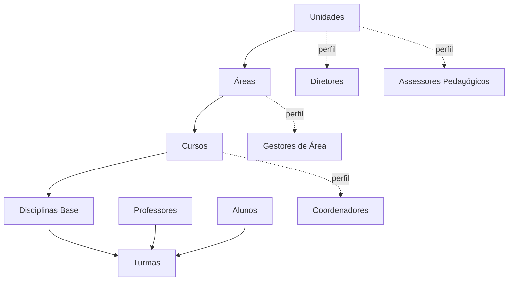
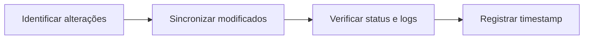

# Fluxo de Sincronização

## Introdução

Este documento especifica o processo completo de sincronização de dados entre sistemas de gestão acadêmica (ERP) e a plataforma ProExtend, incluindo endpoints, estrutura de payloads, tratamento de erros e estratégias de sincronização.

A ordem de sincronização é fundamental devido às dependências entre entidades. O não cumprimento da sequência especificada resultará em erros de validação.

## Ordem de Sincronização

### Sincronização Inicial (Setup Completo)

A configuração inicial requer sincronização completa na seguinte ordem:



:::note
Diretores, Assessores Pedagógicos, Gestores de Área e Coordenadores podem ser sincronizados a qualquer momento após suas dependências (Unidade, Área ou Curso). Eles não bloqueiam o fluxo principal de Turmas.
:::

### Sincronizações Subsequentes

Após a configuração inicial, sincronizações periódicas devem seguir o processo:



## Falhas Parciais na Sincronização

Todos os endpoints de sincronização processam os itens individualmente. Se um item falhar, os demais são processados normalmente. A requisição retorna **HTTP 200** mesmo com falhas parciais.

A resposta sempre inclui os campos `created`, `updated`, `failed` e, quando há falhas, um array `errors` com o detalhamento de cada erro:

```json
{
  "success": true,
  "message": "Sincronização concluída com erros.",
  "data": {
    "created": 8,
    "updated": 1,
    "failed": 1,
    "errors": [
      {
        "index": 2,
        "code": "PROF003",
        "error": "O e-mail já está cadastrado por outro usuário."
      }
    ]
  }
}
```

- `index`: posição do item no array enviado (começa em 0)
- `code`: identificador do item que falhou (quando disponível)
- `error`: descrição do motivo da falha

:::note
Cada request aceita no máximo **500 itens** por sincronização. Para volumes maiores, divida em múltiplas requisições.
:::

## 1. Sincronizar Unidades

**Dependências**: Nenhuma (primeira entidade a ser sincronizada)

```
POST /integration/v1/units/sync
```

Consulte os atributos completos em [Conceitos Fundamentais](conceitos-fundamentais#1-unidade-unit).

## 2. Sincronizar Áreas

**Dependências**: Unidades devem estar sincronizadas

```
POST /integration/v1/areas/sync
```

Consulte os atributos completos em [Conceitos Fundamentais](conceitos-fundamentais#4-área-area).

## 3. Sincronizar Cursos

**Dependências**: Unidades e Áreas devem estar sincronizadas

```
POST /integration/v1/courses/sync
```

Consulte os atributos completos em [Conceitos Fundamentais](conceitos-fundamentais#6-curso-course).

## 4. Sincronizar Disciplinas Base

**Dependências**: Cursos devem estar sincronizados

```
POST /integration/v1/subjects/sync
```

Consulte os atributos completos em [Conceitos Fundamentais](conceitos-fundamentais#8-disciplina-base-subject).

## 5. Sincronizar Professores

**Dependências**: Nenhuma (pode ser sincronizado a qualquer momento)

```
POST /integration/v1/professors/sync
```

Consulte os atributos completos em [Conceitos Fundamentais](conceitos-fundamentais#10-professor-professor).

## 6. Sincronizar Alunos

**Dependências**: Cursos devem estar sincronizados (`course_code` obrigatório)

```
POST /integration/v1/students/sync
```

Consulte os atributos completos em [Conceitos Fundamentais](conceitos-fundamentais#11-aluno-student).

## 7. Sincronizar Turmas (Enrollments)

Turmas representam instâncias de disciplinas base em períodos letivos específicos, incluindo um ou mais docentes responsáveis e estudantes matriculados.

**Dependências**: Disciplinas Base e Professores devem estar sincronizados. Alunos são opcionais na criação da turma

### Endpoint

```
POST /integration/v1/enrollments/sync
```

### Exemplo

```json
{
  "enrollments": [
    {
      "code": "ALG001-2025.1",
      "subject_code": "ALG001",
      "professor_codes": ["PROF001", "PROF002"],
      "semester": "2025.1",
      "course_codes": ["CC001", "SI001"],
      "student_codes": [
        "ALU2024001",
        "ALU2024002"
      ]
    },
    {
      "code": "BD001-2025.1",
      "subject_code": "BD001",
      "professor_codes": ["PROF002"],
      "semester": "2025.1",
      "student_codes": [
        "ALU2024001"
      ]
    }
  ]
}
```

### Campos Obrigatórios

- `code`: Código único da turma (máximo 255 caracteres) - recomendado incluir semestre (exemplo: "ALG001-2025.1")
- `subject_code`: Código da disciplina base vinculada (deve existir)
- `professor_codes`: Array com códigos dos docentes responsáveis (pelo menos um deve existir)
- `semester`: Período letivo (formato: "YYYY.N", exemplos: "2025.1", "2025.2")

:::note[Retrocompatibilidade]
O campo `professor_code` (singular) ainda é aceito por retrocompatibilidade e equivale a `professor_codes: ["PROF001"]`. Prefira usar `professor_codes` (array) em integrações novas.
:::

### Campos Opcionais

- `course_codes`: Cursos adicionais vinculados à turma. Expande a elegibilidade de alunos além do curso da disciplina base
- `student_codes`: Alunos a matricular. Pode ser omitido ou `[]` para criar a turma sem alunos
- `student_sync_mode`: Como os alunos enviados são processados (padrão: `replace`)

Para entender elegibilidade de alunos, múltiplos professores e múltiplos cursos, consulte [Conceitos Fundamentais - Turma](conceitos-fundamentais#9-turma-enrollment).

### Modo de Sincronização de Alunos (`student_sync_mode`)

| Valor | Comportamento |
|---|---|
| `replace` (padrão) | Substitui toda a lista. Alunos não enviados são desvinculados |
| `add` | Apenas adiciona os alunos enviados, sem remover os já matriculados |

Use `replace` quando quiser garantir que a turma tenha exatamente os alunos enviados. Use `add` para adicionar alunos incrementalmente sem precisar reenviar a lista completa.

```json
{
  "enrollments": [
    {
      "code": "ALG001-2025.1",
      "subject_code": "ALG001",
      "professor_codes": ["PROF001"],
      "semester": "2025.1",
      "student_codes": ["ALU2024010", "ALU2024011"],
      "student_sync_mode": "add"
    }
  ]
}
```

### Comportamento de Sincronização

- **Turma existente** (code já cadastrado): Adiciona professores novos sem remover os existentes; processa alunos conforme `student_sync_mode`
- **Turma nova** (code não existe): Cria nova turma com vínculos especificados

## Matrícula e Desmatrícula Avulsa

Para adicionar ou remover um único aluno de uma turma sem precisar reenviar a lista completa, use os endpoints avulsos:

### Matricular um aluno

```
POST /integration/v1/enrollments/{code}/students/{studentCode}
```

```json
{
  "success": true,
  "data": {
    "student_code": "ALU2024010",
    "enrollment_code": "ALG001-2025.1",
    "students_count": 25
  }
}
```

### Desmatricular um aluno

```
DELETE /integration/v1/enrollments/{code}/students/{studentCode}
```

Remove o aluno especificado sem alterar os demais matriculados.

:::note
O aluno precisa pertencer a um dos cursos vinculados à turma (curso da disciplina base ou cursos adicionais via `course_codes`), caso contrário a operação retorna erro 422.
:::

## 8. Sincronizar Diretores

**Dependências**: Unidades devem estar sincronizadas

```
POST /integration/v1/directors/sync
```

Consulte os atributos completos em [Conceitos Fundamentais](conceitos-fundamentais#2-diretor-director).

## 9. Sincronizar Assessores Pedagógicos

**Dependências**: Unidades devem estar sincronizadas

```
POST /integration/v1/pedagogical-advisors/sync
```

Consulte os atributos completos em [Conceitos Fundamentais](conceitos-fundamentais#3-assessor-pedagógico-pedagogical-advisor).

## 10. Sincronizar Gestores de Área

**Dependências**: Áreas devem estar sincronizadas

```
POST /integration/v1/area-managers/sync
```

Consulte os atributos completos em [Conceitos Fundamentais](conceitos-fundamentais#5-gestor-de-área-area-manager).

## 11. Sincronizar Coordenadores

**Dependências**: Cursos devem estar sincronizados

```
POST /integration/v1/coordinators/sync
```

Consulte os atributos completos em [Conceitos Fundamentais](conceitos-fundamentais#7-coordenador-coordinator).

## Consultando Status da Sincronização

Após a sincronização, é possível verificar o status geral e estatísticas das entidades sincronizadas.

### Endpoint

```
GET /integration/v1/sync-status
```

### Exemplo

```bash
curl -X GET https://{{instituicao}}.proextend.com.br/api/integration/v1/sync-status \
  -H "Authorization: Bearer pex_..."
```

### Resposta

```json
{
  "success": true,
  "data": {
    "last_sync": {
      "timestamp": "2025-12-31T10:00:00Z",
      "minutes_ago": 15
    },
    "entities": {
      "units": { "total": 3 },
      "areas": { "total": 8 },
      "courses": { "total": 15 },
      "subjects": { "total": 120 },
      "professors": { "total": 45 },
      "students": { "total": 850 },
      "enrollments": { "total": 2340 },
      "directors": { "total": 4 },
      "pedagogical_advisors": { "total": 6 },
      "area_managers": { "total": 8 },
      "coordinators": { "total": 15 }
    },
    "api_client": {
      "name": "Integração - Acesso Completo",
      "scope": "full",
      "rate_limit": 60
    }
  }
}
```

## Consultando Dados Sincronizados

A API disponibiliza endpoints de consulta (GET) para verificação de dados sincronizados. Todos os endpoints de listagem suportam paginação com `per_page` (padrão: 50, máximo: 200) e `page`.

### Exemplos de Consulta

```
GET /integration/v1/units?search=centro
GET /integration/v1/areas?unit_code=CAMPUS_CENTRO
GET /integration/v1/courses?area_code=TECH&unit_code=CAMPUS_CENTRO
GET /integration/v1/professors?active_only=1&per_page=100
GET /integration/v1/students?course_code=CC001&active_only=1
GET /integration/v1/enrollments?professor_code=PROF001&semester=2025.1
GET /integration/v1/professors/PROF001/subjects?semester=2025.1
```

### Buscar Entidade por Code

```
GET /integration/v1/units/CAMPUS_CENTRO
GET /integration/v1/professors/PROF001
GET /integration/v1/students/ALU2024001
GET /integration/v1/enrollments/ALG001-2025.1
```

## Tratamento de Erros

### Códigos de Status HTTP

- **200 OK**: Operação bem-sucedida
- **401 Unauthorized**: API Key inválida ou ausente
- **422 Unprocessable Entity**: Erro de validação de dados
- **429 Too Many Requests**: Limite de taxa excedido
- **500 Internal Server Error**: Erro interno do servidor

### Erros de Dependência

**Cenário**: Um ou mais itens do lote referenciam entidades que ainda não existem (ex: `area_code` inválido em um sync de cursos).

O item com a referência inválida falha individualmente, os demais do lote são processados normalmente. A requisição retorna **HTTP 200** com `failed: N`:

```json
{
  "success": true,
  "message": "Sincronização de cursos concluída com erros.",
  "data": {
    "created": 1,
    "updated": 0,
    "failed": 1,
    "errors": [
      {
        "index": 1,
        "code": "ENF001",
        "error": "Área 'HEALTH' não encontrada."
      }
    ]
  }
}
```

**Solução**: Sincronizar entidades na ordem correta de dependências:

```
Units → Areas → Courses → Subjects → Professors/Students → Enrollments
```

### Erros de Duplicação

**Cenário**: Tentativa de criar registro com email ou CPF já cadastrado

**Resposta de Erro**:

```json
{
  "success": false,
  "message": "Erro de validação",
  "errors": {
    "email": ["Email já cadastrado na plataforma"]
  }
}
```

**Observação**: A API implementa comportamento idempotente. Sincronização com code existente resulta em **atualização** ao invés de duplicação. Este erro ocorre quando campos únicos (email/CPF) conflitam com registros diferentes.

### Erros de Validação de Formato

**Cenário 1: CPF inválido**

```json
{
  "success": false,
  "message": "Erro de validação",
  "errors": {
    "professors.0.cpf": ["O CPF informado é inválido."]
  }
}
```

**Observação**: O CPF é validado conforme algoritmo oficial. Deve ser enviado com apenas 11 dígitos numéricos, sem formatação (`12345678901`).

**Cenário 2: Telefone com formato inválido**

```json
{
  "success": false,
  "message": "Erro de validação",
  "errors": {
    "professors.0.phone": ["O telefone deve conter apenas dígitos."]
  }
}
```

**Observação**: O telefone deve conter apenas números, sem parênteses, espaços ou hífens.

**Cenário 3: Campo excede tamanho máximo**

```json
{
  "success": false,
  "message": "Erro de validação",
  "errors": {
    "areas.0.code": ["O código não pode ter mais de 255 caracteres."]
  }
}
```

**Solução**: Validar formato e consistência dos dados no sistema de origem antes do envio.

## Estratégias de Sincronização

### Sincronização Completa (Recomendada para Setup Inicial)

A sincronização completa deve ser utilizada na configuração inicial do sistema. Ela consiste em enviar todas as entidades para a API na ordem de dependência correta:

1. **Unidades** - Estabelecimentos de ensino
2. **Diretores** e **Assessores Pedagógicos** - Perfis vinculados à Unidade (podem ser sincronizados após o passo 1)
3. **Áreas** - Áreas de conhecimento
4. **Gestores de Área** - Perfis vinculados à Área (podem ser sincronizados após o passo 3)
5. **Cursos** - Cursos oferecidos
6. **Coordenadores** - Perfis vinculados ao Curso (podem ser sincronizados após o passo 5)
7. **Disciplinas Base** - Disciplinas que compõem os cursos
8. **Professores** - Corpo docente (independente, pode ser sincronizado a qualquer momento)
9. **Alunos** - Estudantes matriculados (independente, pode ser sincronizado a qualquer momento)
10. **Turmas** - Instâncias de disciplinas com professores e alunos vinculados

> **Importante**: Respeite essa ordem para evitar erros de dependência. Entidades filhas referenciam os codes das entidades pai, que devem existir previamente.

### Sincronização Incremental (Recomendada para Atualizações)

Após a sincronização inicial, utilize a sincronização incremental para otimizar o processo:

1. **Identifique mudanças** - Determine quais registros foram criados, alterados ou excluídos desde a última sincronização
2. **Envie apenas alterações** - Sincronize apenas os dados modificados
3. **Registre timestamp** - Armazene a data/hora da última sincronização para a próxima execução

**Benefícios**:
- Reduz o volume de dados transmitidos
- Diminui o tempo de processamento
- Minimiza o impacto no sistema

### Sincronização em Lote

Agrupe múltiplos registros em uma única requisição para melhorar a performance:

```json
{
  "professors": [
    { "code": "PROF001", "name": "Dr. João Silva", "email": "joao@escola.com" },
    { "code": "PROF002", "name": "Dra. Maria Santos", "email": "maria@escola.com" },
    { "code": "PROF003", "name": "Dr. Carlos Oliveira", "email": "carlos@escola.com" }
  ]
}
```

**Recomendações**:
- Envie lotes de até 100 registros por requisição
- Implemente retry automático em caso de falhas
- Registre logs de sincronização para auditoria

## Próximos Passos

1. Compreender sistema de [Identificadores e codes](identificadores-e-codes)
2. Testar requisições diretamente pelo [playground interativo](/api)
3. Configurar rotina de sincronização periódica (incremental)
4. Implementar monitoramento e alertas de falhas via [Logs de Integrações](logs-de-integracoes)
