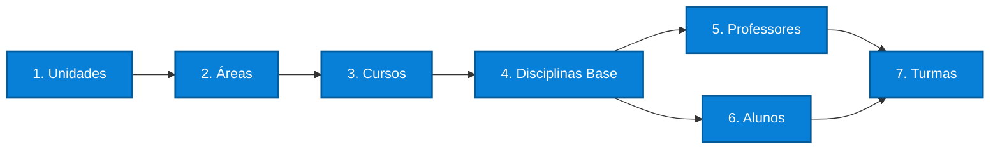

# Fluxo de Sincronização

## Introdução

Este documento especifica o processo completo de sincronização de dados entre sistemas de gestão acadêmica (ERP) e a plataforma ProExtend, incluindo endpoints, estrutura de payloads, tratamento de erros e estratégias de sincronização.

A ordem de sincronização é fundamental devido às dependências entre entidades. O não cumprimento da sequência especificada resultará em erros de validação.

## Ordem de Sincronização

### Sincronização Inicial (Setup Completo)

A configuração inicial requer sincronização completa na seguinte ordem:



### Sincronizações Subsequentes

Após a configuração inicial, sincronizações periódicas devem seguir o processo:


## Falhas Parciais na Sincronização

Todos os endpoints de sincronização processam os itens individualmente. Se um item falhar, os demais são processados normalmente. A requisição retorna **HTTP 200** mesmo com falhas parciais.

A resposta sempre inclui os campos `created`, `updated`, `failed` e, quando há falhas, um array `errors` com o detalhamento de cada erro:

```json
{
  "success": true,
  "message": "Sincronização concluída com erros.",
  "data": {
    "created": 8,
    "updated": 1,
    "failed": 1,
    "errors": [
      {
        "index": 2,
        "code": "PROF003",
        "error": "O e-mail já está cadastrado por outro usuário."
      }
    ]
  }
}
```

- `index`: posição do item no array enviado (começa em 0)
- `code`: identificador do item que falhou (quando disponível)
- `error`: descrição do motivo da falha

:::note
Cada request aceita no máximo **500 itens** por sincronização. Para volumes maiores, divida em múltiplas requisições.
:::

## 1. Sincronizar Unidades

Unidades representam campus ou estabelecimentos físicos da instituição de ensino.

**Dependências**: Nenhuma (primeira entidade a ser sincronizada)

### Endpoint

```
POST /integration/v1/units/sync
```

### Exemplo de Requisição

```bash
curl -X POST https://{{instituicao}}.proextend.com.br/api/integration/v1/units/sync \
  -H "Authorization: Bearer pex_..." \
  -H "Content-Type: application/json" \
  -d '{
    "units": [
      {
        "code": "CAMPUS_CENTRO",
        "name": "Campus Centro",
        "address": "Rua Principal, 123 - Centro, São Paulo - SP"
      },
      {
        "code": "CAMPUS_NORTE",
        "name": "Campus Zona Norte",
        "address": "Av. Norte, 456 - Zona Norte, São Paulo - SP"
      }
    ]
  }'
```

### Campos Obrigatórios

- `code`: Código único da unidade (exemplo: "CAMPUS_CENTRO")
- `name`: Nome da unidade

### Campos Opcionais

- `address`: Endereço completo

### Resposta

```json
{
  "success": true,
  "message": "Sincronização de unidades concluída.",
  "data": {
    "created": 2,
    "updated": 0,
    "failed": 0
  }
}
```

## 2. Sincronizar Áreas

Áreas de conhecimento que agrupam cursos relacionados.

**Dependências**: Unidades devem estar sincronizadas

### Endpoint

```
POST /integration/v1/areas/sync
```

### Exemplo

```json
{
  "areas": [
    {
      "code": "TECH",
      "name": "Tecnologia da Informação",
      "unit_code": "CAMPUS_CENTRO",
      "responsible_email": "coord.tech@faculdade.edu.br"
    },
    {
      "code": "HEALTH",
      "name": "Ciências da Saúde",
      "unit_code": "CAMPUS_NORTE"
    }
  ]
}
```

### Campos Obrigatórios

- `code`: Código único da área (máximo 255 caracteres)
- `name`: Nome da área (máximo 255 caracteres)
- `unit_code`: Código da unidade (deve existir)
- `responsible_email` **OU** `responsible_code`: Pelo menos um deles é obrigatório

### Campos Opcionais

- `responsible_email`: Email do responsável (deve ser Admin ativo)
- `responsible_code`: Código do responsável (deve ser Admin ativo)

:::note[IMPORTANTE]
O responsável pela área deve ser um Administrador (Admin):

- Profile type deve ser `'admin'`
- Não pode estar suspenso (`suspended_at` deve ser `null`)
- Não aceita Professor ou Aluno como responsável

Se o responsável não for um Admin ou estiver suspenso, a sincronização falhará com erro 422.
:::

## 3. Sincronizar Cursos

Programas acadêmicos oferecidos pela instituição de ensino.

**Dependências**: Unidades e Áreas devem estar sincronizadas

### Endpoint

```
POST /integration/v1/courses/sync
```

### Exemplo

```json
{
  "courses": [
    {
      "code": "CC001",
      "name": "Ciência da Computação",
      "description": "Bacharelado em Ciência da Computação - Duração 4 anos",
      "area_code": "TECH",
      "unit_code": "CAMPUS_CENTRO",
      "responsible_code": "ADMIN001"
    },
    {
      "code": "ENF001",
      "name": "Enfermagem",
      "description": "Bacharelado em Enfermagem - Duração 5 anos",
      "area_code": "HEALTH",
      "unit_code": "CAMPUS_NORTE",
      "responsible_email": "coord.enf@faculdade.edu.br"
    }
  ]
}
```

### Campos Obrigatórios

- `code`: Código único do curso (máximo 255 caracteres)
- `name`: Nome do curso (máximo 255 caracteres)
- `area_code`: Código da área (deve existir)
- `unit_code`: Código da unidade (deve existir)
- `responsible_email` **OU** `responsible_code`: Pelo menos um deles é obrigatório

### Campos Opcionais

- `description`: Descrição detalhada

:::note[IMPORTANTE]
O responsável pelo curso deve ser um Administrador (Admin):

- Profile type deve ser `'admin'`
- Não pode estar suspenso (`suspended_at` deve ser `null`)
- Não aceita Professor ou Aluno como responsável
- Se ambos `responsible_email` e `responsible_code` forem fornecidos, `responsible_code` tem prioridade

Se o responsável não for um Admin ou estiver suspenso, a sincronização falhará com erro 422.
:::

## 4. Sincronizar Disciplinas Base

Componentes curriculares que compõem a grade dos cursos. Representam o cadastro permanente no catálogo curricular, sem vínculo com períodos letivos ou matrículas.

**Dependências**: Cursos devem estar sincronizados

### Endpoint

```
POST /integration/v1/subjects/sync
```

### Exemplo

```json
{
  "subjects": [
    {
      "code": "ALG001",
      "name": "Algoritmos e Programação I",
      "course_code": "CC001"
    },
    {
      "code": "BD001",
      "name": "Banco de Dados I",
      "course_code": "CC001"
    },
    {
      "code": "LIBRAS",
      "name": "Língua Brasileira de Sinais",
      "course_code": "CC001",
      "type": "optativa"
    }
  ]
}
```

### Campos Obrigatórios

- `code`: Código único da disciplina (máximo 255 caracteres)
- `name`: Nome da disciplina (máximo 255 caracteres)
- `course_code`: Código do curso (deve existir)

### Campos Opcionais

- `type`: Tipo de disciplina
  - `obrigatoria` (padrão se omitido)
  - `optativa`
  - `eletiva`

## 5. Sincronizar Professores

Corpo docente da instituição de ensino.

**Dependências**: Nenhuma (entidade independente, pode ser sincronizada a qualquer momento)

 

### Endpoint

```
POST /integration/v1/professors/sync
```

### Exemplo

```json
{
  "professors": [
    {
      "code": "PROF001",
      "name": "Dr. João Silva",
      "email": "joao.silva@faculdade.edu.br",
      "cpf": "12345678901",
      "phone": "11999999999",
      "area_code": "TECH"
    },
    {
      "code": "PROF002",
      "name": "Dra. Maria Santos",
      "email": "maria.santos@faculdade.edu.br",
      "cpf": "98765432100",
      "area_code": "TECH"
    }
  ]
}
```

### Campos Obrigatórios

- `code`: Código único do professor (máximo 255 caracteres) - matrícula, CPF ou código funcional
- `name`: Nome completo do docente (máximo 255 caracteres)
- `email`: Email institucional (deve ser único na plataforma)

### Campos Opcionais

- `cpf`: CPF, apenas 11 dígitos numéricos sem formatação (ex: `12345678901`). Deve ser válido conforme algoritmo de verificação
- `phone`: Telefone de contato, apenas dígitos numéricos (ex: `11999999999`). Não aceita parênteses, espaços ou hífens
- `area_code`: Código da área de atuação (deve existir se fornecido)

### Validações Importantes

- Email duplicado resulta em erro 422 (Unprocessable Entity)
- CPF duplicado resulta em erro 422 (Unprocessable Entity)
- Code deve ser único entre professores
- CPF é campo opcional

## 6. Sincronizar Alunos

Estudantes matriculados em programas acadêmicos.

**Dependências**: Nenhuma (entidade independente, pode ser sincronizada a qualquer momento)


### Endpoint

```
POST /integration/v1/students/sync
```

### Exemplo

```json
{
  "students": [
    {
      "code": "ALU2024001",
      "name": "Pedro Oliveira Santos",
      "email": "pedro.oliveira@aluno.edu.br",
      "cpf": "11122233344",
      "phone": "11977777777",
      "course_code": "CC001"
    },
    {
      "code": "12345678901",
      "name": "Ana Costa Ferreira",
      "email": "ana.costa@aluno.edu.br",
      "cpf": "12345678901",
      "course_code": "ENF001"
    }
  ]
}
```

### Campos Obrigatórios

- `code`: Código único do aluno (máximo 255 caracteres) - matrícula, CPF ou RA
- `name`: Nome completo do estudante (máximo 255 caracteres)
- `email`: Email institucional (deve ser único na plataforma)
- `course_code`: Código do curso ao qual está matriculado (deve existir)

### Campos Opcionais

- `cpf`: CPF, apenas 11 dígitos numéricos sem formatação (ex: `12345678901`). Deve ser válido conforme algoritmo de verificação
- `phone`: Telefone de contato, apenas dígitos numéricos (ex: `11999999999`). Não aceita parênteses, espaços ou hífens

### Observações Importantes

- Campo `code` possui formato flexível: matrícula, CPF ou RA
- Email duplicado resulta em erro 422 (Unprocessable Entity)
- CPF duplicado (se fornecido) resulta em erro 422
- CPF é campo opcional

## 7. Sincronizar Administradores

Administradores são os gestores da instituição que podem ser vinculados a unidades, áreas e cursos como responsáveis.

**Dependências**: Nenhuma (entidade independente)

:::note
Administradores também podem ser criados e gerenciados diretamente pelo painel ProExtend. A sincronização via API é opcional e complementar.
:::

### Endpoint

```
POST /integration/v1/admins/sync
```

### Exemplo

```json
{
  "admins": [
    {
      "code": "ADMIN001",
      "name": "Carlos Souza",
      "email": "carlos.souza@faculdade.edu.br",
      "unit_code": "CAMPUS_CENTRO"
    },
    {
      "code": "ADMIN002",
      "name": "Fernanda Costa",
      "email": "fernanda.costa@faculdade.edu.br",
      "area_code": "TECH"
    }
  ]
}
```

### Campos Obrigatórios

- `code`: Código único do administrador (máximo 255 caracteres)
- `name`: Nome completo (máximo 255 caracteres)
- `email`: Email institucional (deve ser único na plataforma)

### Campos Opcionais

- `cpf`: CPF, apenas 11 dígitos numéricos sem formatação (ex: `12345678901`)
- `phone`: Telefone de contato, apenas dígitos numéricos (ex: `11999999999`)
- `unit_code`: Código da unidade de atuação (deve existir se fornecido)
- `area_code`: Código da área de atuação (deve existir se fornecido)
- `course_code`: Código do curso de atuação (deve existir se fornecido)

## 8. Sincronizar Turmas (Enrollments)

Turmas representam instâncias de disciplinas base em períodos letivos específicos, incluindo docente responsável e estudantes matriculados.

**Dependências**: Disciplinas Base, Professores e Alunos devem estar sincronizados

### Endpoint

```
POST /integration/v1/enrollments/sync
```

### Exemplo

```json
{
  "enrollments": [
    {
      "code": "ALG001-2025.1",
      "subject_code": "ALG001",
      "professor_code": "PROF001",
      "semester": "2025.1",
      "student_codes": [
        "ALU2024001",
        "ALU2024002"
      ]
    },
    {
      "code": "BD001-2025.1",
      "subject_code": "BD001",
      "professor_code": "PROF002",
      "semester": "2025.1",
      "student_codes": [
        "ALU2024001"
      ]
    }
  ]
}
```

### Campos Obrigatórios

- `code`: Código único da turma (máximo 255 caracteres) - recomendado incluir semestre (exemplo: "ALG001-2025.1")
- `subject_code`: Código da disciplina base vinculada (deve existir)
- `professor_code`: Código do docente responsável (deve existir)
- `semester`: Período letivo (formato: "YYYY.N", exemplos: "2025.1", "2025.2")

### Campos Opcionais

- `student_codes`: Array contendo códigos dos alunos matriculados (devem existir)
  - Pode ser omitido ou enviado como array vazio `[]`
  - Útil para criar turmas antes de ter alunos matriculados
- `student_sync_mode`: Define como os alunos enviados são processados (padrão: `replace`)

### Modo de Sincronização de Alunos (`student_sync_mode`)

| Valor | Comportamento |
|---|---|
| `replace` (padrão) | Substitui toda a lista. Alunos não enviados são desvinculados |
| `add` | Apenas adiciona os alunos enviados, sem remover os já matriculados |

Use `replace` quando quiser garantir que a turma tenha exatamente os alunos enviados. Use `add` para adicionar alunos incrementalmente sem precisar reenviar a lista completa.

```json
{
  "enrollments": [
    {
      "code": "ALG001-2025.1",
      "subject_code": "ALG001",
      "professor_code": "PROF001",
      "semester": "2025.1",
      "student_codes": ["ALU2024010", "ALU2024011"],
      "student_sync_mode": "add"
    }
  ]
}
```

### Comportamento de Sincronização

- **Turma existente** (code já cadastrado): Atualiza professor e processa alunos conforme `student_sync_mode`
- **Turma nova** (code não existe): Cria nova turma com vínculos especificados

## Matrícula e Desmatrícula Avulsa

Para adicionar ou remover um único aluno de uma turma sem precisar reenviar a lista completa, use os endpoints avulsos:

### Matricular um aluno

```
POST /integration/v1/enrollments/{code}/students/{studentCode}
```

```json
{
  "success": true,
  "data": {
    "student_code": "ALU2024010",
    "enrollment_code": "ALG001-2025.1",
    "students_count": 25
  }
}
```

### Desmatricular um aluno

```
DELETE /integration/v1/enrollments/{code}/students/{studentCode}
```

Remove o aluno especificado sem alterar os demais matriculados.

:::note
O aluno precisa pertencer ao mesmo curso da disciplina da turma, caso contrário a operação retorna erro 422.
:::

## Consultando Status da Sincronização

Após a sincronização, é possível verificar o status geral e estatísticas das entidades sincronizadas.

### Endpoint

```
GET /integration/v1/sync-status
```

### Exemplo

```bash
curl -X GET https://{{instituicao}}.proextend.com.br/api/integration/v1/sync-status \
  -H "Authorization: Bearer pex_..."
```

### Resposta

```json
{
  "success": true,
  "data": {
    "last_sync": {
      "timestamp": "2025-12-31T10:00:00Z",
      "minutes_ago": 15
    },
    "entities": {
      "units": { "total": 3 },
      "areas": { "total": 8 },
      "courses": { "total": 15 },
      "subjects": { "total": 120 },
      "professors": { "total": 45 },
      "students": { "total": 850 },
      "enrollments": { "total": 2340 }
    },
    "api_client": {
      "name": "Integração - Acesso Completo",
      "scope": "full",
      "rate_limit": 60
    }
  }
}
```

## Consultando Dados Sincronizados

A API disponibiliza endpoints de consulta (GET) para verificação de dados sincronizados. Todos os endpoints de listagem suportam paginação com `per_page` (padrão: 50, máximo: 200) e `page`.

### Filtros Disponíveis por Endpoint

| Endpoint | Filtros disponíveis |
|---|---|
| `GET /units` | `search` |
| `GET /areas` | `unit_code`, `search` |
| `GET /courses` | `area_code`, `unit_code`, `search` |
| `GET /subjects` | `course_code` |
| `GET /professors` | `active_only` |
| `GET /students` | `course_code`, `active_only` |
| `GET /enrollments` | `professor_code`, `subject_code`, `semester` |
| `GET /professors/{code}/subjects` | `semester` |
| `GET /admins` | `unit_code`, `area_code`, `active_only` |
| `GET /students/{code}/enrollments` | (sem filtros, paginação padrão) |

O filtro `active_only` aceita qualquer valor para ativar (ex: `active_only=1`). Retorna apenas usuários não suspensos.

### Exemplos de Consulta

```
GET /integration/v1/units?search=centro
GET /integration/v1/areas?unit_code=CAMPUS_CENTRO
GET /integration/v1/courses?area_code=TECH&unit_code=CAMPUS_CENTRO
GET /integration/v1/professors?active_only=1&per_page=100
GET /integration/v1/students?course_code=CC001&active_only=1
GET /integration/v1/enrollments?professor_code=PROF001&semester=2025.1
GET /integration/v1/professors/PROF001/subjects?semester=2025.1
```

### Buscar Entidade por Code

```
GET /integration/v1/units/CAMPUS_CENTRO
GET /integration/v1/professors/PROF001
GET /integration/v1/students/ALU2024001
GET /integration/v1/enrollments/ALG001-2025.1
```

## Tratamento de Erros

### Códigos de Status HTTP

- **200 OK**: Operação bem-sucedida
- **401 Unauthorized**: API Key inválida ou ausente
- **422 Unprocessable Entity**: Erro de validação de dados
- **429 Too Many Requests**: Limite de taxa excedido
- **500 Internal Server Error**: Erro interno do servidor

### Erros de Dependência

**Cenário**: Um ou mais itens do lote referenciam entidades que ainda não existem (ex: `area_code` inválido em um sync de cursos).

O item com a referência inválida falha individualmente — os demais do lote são processados normalmente. A requisição retorna **HTTP 200** com `failed: N`:

```json
{
  "success": true,
  "message": "Sincronização de cursos concluída com erros.",
  "data": {
    "created": 1,
    "updated": 0,
    "failed": 1,
    "errors": [
      {
        "index": 1,
        "code": "ENF001",
        "error": "Área 'HEALTH' não encontrada."
      }
    ]
  }
}
```

**Solução**: Sincronizar entidades na ordem correta de dependências:

```
Units → Areas → Courses → Subjects → Professors/Students → Enrollments
```

### Erros de Duplicação

**Cenário**: Tentativa de criar registro com email ou CPF já cadastrado

**Resposta de Erro**:

```json
{
  "success": false,
  "message": "Erro de validação",
  "errors": {
    "email": ["Email já cadastrado na plataforma"]
  }
}
```

**Observação**: A API implementa comportamento idempotente. Sincronização com code existente resulta em **atualização** ao invés de duplicação. Este erro ocorre quando campos únicos (email/CPF) conflitam com registros diferentes.

### Erros de Validação de Formato

**Cenário 1: CPF inválido**

```json
{
  "success": false,
  "message": "Erro de validação",
  "errors": {
    "professors.0.cpf": ["O CPF informado é inválido."]
  }
}
```

**Observação**: O CPF é validado conforme algoritmo oficial. Deve ser enviado com apenas 11 dígitos numéricos, sem formatação (`12345678901`).

**Cenário 2: Telefone com formato inválido**

```json
{
  "success": false,
  "message": "Erro de validação",
  "errors": {
    "professors.0.phone": ["O telefone deve conter apenas dígitos."]
  }
}
```

**Observação**: O telefone deve conter apenas números, sem parênteses, espaços ou hífens.

**Cenário 3: Campo excede tamanho máximo**

```json
{
  "success": false,
  "message": "Erro de validação",
  "errors": {
    "areas.0.code": ["O código não pode ter mais de 255 caracteres."]
  }
}
```

**Solução**: Validar formato e consistência dos dados no sistema origem antes do envio.

## Estratégias de Sincronização

### Sincronização Completa (Recomendada para Setup Inicial)

A sincronização completa deve ser utilizada na configuração inicial do sistema. Ela consiste em enviar todas as entidades para a API na ordem de dependência correta:

1. **Unidades** - Estabelecimentos de ensino
2. **Áreas** - Áreas de conhecimento
3. **Cursos** - Cursos oferecidos
4. **Disciplinas Base** - Disciplinas que compõem os cursos
5. **Professores** - Corpo docente
6. **Alunos** - Estudantes matriculados
7. **Administradores** - Gestores da instituição (independente, pode ser em qualquer momento)
8. **Turmas** - Matrículas e vínculos entre alunos e disciplinas

> **Importante**: Respeite essa ordem para evitar erros de dependência. Áreas e Cursos precisam de um Admin como `responsible_code`, então sincronize Admins antes se for usar esse campo.

### Sincronização Incremental (Recomendada para Atualizações)

Após a sincronização inicial, utilize a sincronização incremental para otimizar o processo:

1. **Identifique mudanças** - Determine quais registros foram criados, alterados ou excluídos desde a última sincronização
2. **Envie apenas alterações** - Sincronize apenas os dados modificados
3. **Registre timestamp** - Armazene a data/hora da última sincronização para a próxima execução

**Benefícios**:
- Reduz o volume de dados transmitidos
- Diminui o tempo de processamento
- Minimiza o impacto no sistema

### Sincronização em Lote

Agrupe múltiplos registros em uma única requisição para melhorar a performance:

```json
{
  "professors": [
    { "code": "PROF001", "name": "Dr. João Silva", "email": "joao@escola.com" },
    { "code": "PROF002", "name": "Dra. Maria Santos", "email": "maria@escola.com" },
    { "code": "PROF003", "name": "Dr. Carlos Oliveira", "email": "carlos@escola.com" }
  ]
}
```

**Recomendações**:
- Envie lotes de até 100 registros por requisição
- Implemente retry automático em caso de falhas
- Registre logs de sincronização para auditoria

## Próximos Passos

1. Compreender sistema de [Identificadores e Codes](identificadores-e-codes)
2. Testar requisições diretamente pelo [playground interativo](/api)
3. Configurar rotina de sincronização periódica (incremental)
4. Implementar monitoramento e alertas de falhas
