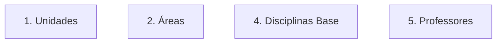
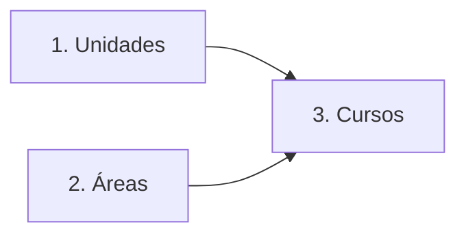
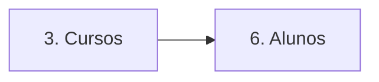
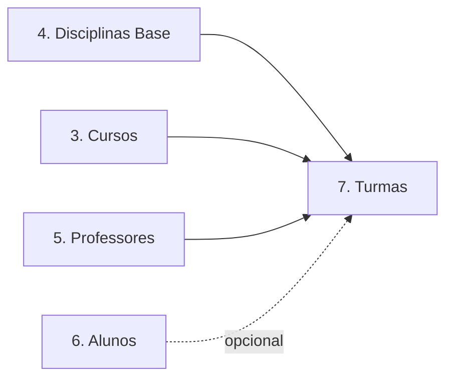
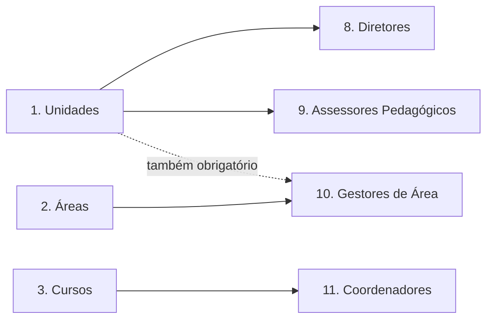
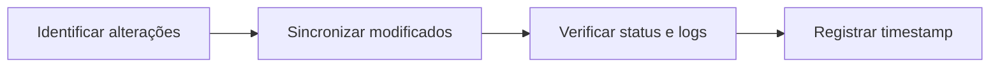

# Fluxo de Sincronização

## Introdução

Este documento especifica o processo completo de sincronização de dados entre sistemas de gestão acadêmica (ERP) e a plataforma ProExtend, incluindo endpoints, estrutura de payloads, tratamento de erros e estratégias de sincronização.

A ordem de sincronização é fundamental devido às dependências entre entidades. O não cumprimento da sequência especificada resultará em erros de validação.

## Ordem de Sincronização

### Sincronização Inicial (Setup Completo)

A configuração inicial requer sincronização completa na seguinte ordem:

Para o setup inicial, sincronize as entidades na ordem abaixo. Cada etapa só pode começar depois que suas dependências (lista no topo de cada bloco) estiverem sincronizadas.

<Steps>

<Step title="Etapa 1 - Entidades sem dependências">

Estas entidades não dependem de nenhuma outra e podem ser sincronizadas em paralelo. Cada uma é referenciada mais adiante por outras entidades.



</Step>

<Step title="Etapa 2 - Cursos">

Depende de **Unidade** e **Área** (ambos os `code` precisam existir).



</Step>

<Step title="Etapa 3 - Alunos">

Depende de **Curso** (cada aluno informa seu `course_code`).



</Step>

<Step title="Etapa 4 - Turmas">

Depende de **Disciplina Base**, **Cursos** (`course_codes`, mínimo 1) e **Professores** (`professor_codes`, mínimo 1). Alunos são opcionais e podem ser matriculados depois via endpoint avulso.



</Step>

</Steps>

### Perfis vinculados (sincronização independente)

Diretor, Assessor Pedagógico, Gestor de Área e Coordenador podem ser sincronizados a qualquer momento após suas dependências e **não bloqueiam o fluxo principal** de Turmas.



### Sincronizações Subsequentes

Após a configuração inicial, sincronizações periódicas devem seguir o processo:



## Falhas Parciais na Sincronização

Endpoints de sincronização processam os itens individualmente. Se algum item falhar, os demais continuam sendo processados e a requisição retorna **HTTP 200** mesmo assim. A resposta traz `created`, `updated`, `failed` e, quando há falhas, `data.errors[]` com o detalhamento de cada item que não passou.

Shape do `errors[]`, acumulação de múltiplos erros por item, batch misto e exemplos estão em [Tratamento de Erros - Sync com falhas parciais](tratamento-de-erros#sync-com-falhas-parciais-200).

:::note
Cada request aceita no máximo **500 itens** por sincronização. Para volumes maiores, divida em múltiplas requisições.
:::

## Modos de Sincronização: `add` vs. `replace`

Algumas entidades possuem **arrays de vínculos** com outras entidades: uma Turma tem listas de professores, cursos e alunos; um Gestor de Área tem uma lista de áreas; um Coordenador tem uma lista de cursos. Em todas essas situações, a API precisa saber se a lista enviada deve **substituir** os vínculos atuais ou apenas **adicionar** novos vínculos aos existentes.

Esse comportamento é controlado pelos campos `*_sync_mode`, que aceitam dois valores:

- **`replace` (padrão)**: a lista enviada substitui completamente a lista atual. Vínculos não enviados são removidos.
- **`add`**: a lista enviada é mesclada com a lista atual. Vínculos não enviados são preservados.

Se você não enviar o campo `*_sync_mode`, a API usa `replace` por padrão.

### Onde se aplica

| Campo | Entidade | Controla | Padrão |
|---|---|---|---|
| `professor_sync_mode` | Turma | Lista de professores responsáveis | `replace` |
| `course_sync_mode` | Turma e Coordenador | Lista de cursos vinculados | `replace` |
| `student_sync_mode` | Turma | Lista de alunos matriculados | `replace` |
| `area_sync_mode` | Gestor de Área | Lista de áreas gerenciadas | `replace` |

### Quando usar `replace`

Use `replace` (ou simplesmente omita o campo) quando o ERP é a fonte da verdade e você está enviando o estado **completo** dos vínculos. Esse é o cenário mais comum: a cada sincronização, o ERP envia tudo que aquele recurso deve ter, e a plataforma se ajusta.

### Quando usar `add`

Use `add` quando você está enviando apenas o **delta** (uma adição), sem ter a lista completa em mãos. Casos típicos:

- Adicionar um novo professor a uma turma sem precisar reenviar os professores antigos.
- Vincular um curso adicional a um coordenador sem desvincular os outros.
- Matricular alguns alunos novos sem desmatricular os existentes (alternativa ao endpoint avulso de matrícula).

### Exemplo: combinando modos diferentes

Cada array tem seu próprio modo independente. O exemplo abaixo adiciona um professor e dois alunos à turma `ALG001-2025.1` sem remover quem já estava lá, mas **substitui** a lista de cursos (porque `course_sync_mode` foi omitido e usa o default `replace`):

```json
{
  "enrollments": [
    {
      "code": "ALG001-2025.1",
      "subject_code": "ALG001",
      "semester": "2025.1",
      "professor_codes": ["PROF003"],
      "professor_sync_mode": "add",
      "course_codes": ["CC001"],
      "student_codes": ["ALU2024010", "ALU2024011"],
      "student_sync_mode": "add"
    }
  ]
}
```

### Comportamento em recurso novo

`*_sync_mode` só faz diferença quando o recurso **já existe**. Em recursos novos (`code` inédito), os dois modos produzem o mesmo resultado: a lista enviada é a lista inicial do recurso recém-criado.

## 1. Sincronizar Unidades

**Dependências**: Nenhuma (primeira entidade a ser sincronizada)

<ApiEndpoint method="POST" path="/integration/v1/units/sync" />

Consulte os atributos completos em [Conceitos Fundamentais](conceitos-fundamentais#1-unidade-unit).

## 2. Sincronizar Áreas

**Dependências**: Nenhuma (Área é entidade global da instituição)

<ApiEndpoint method="POST" path="/integration/v1/areas/sync" />

Consulte os atributos completos em [Conceitos Fundamentais](conceitos-fundamentais#4-área-area).

## 3. Sincronizar Cursos

**Dependências**: Unidades e Áreas devem estar sincronizadas

<ApiEndpoint method="POST" path="/integration/v1/courses/sync" />

Consulte os atributos completos em [Conceitos Fundamentais](conceitos-fundamentais#6-curso-course).

## 4. Sincronizar Disciplinas Base

**Dependências**: Nenhuma (Disciplina Base é entidade global da instituição)

<ApiEndpoint method="POST" path="/integration/v1/subjects/sync" />

Consulte os atributos completos em [Conceitos Fundamentais](conceitos-fundamentais#8-disciplina-base-subject).

## 5. Sincronizar Professores

**Dependências**: Nenhuma (pode ser sincronizado a qualquer momento)

<ApiEndpoint method="POST" path="/integration/v1/professors/sync" />

Consulte os atributos completos em [Conceitos Fundamentais](conceitos-fundamentais#10-professor-professor).

## 6. Sincronizar Alunos

**Dependências**: Cursos devem estar sincronizados (`course_code` obrigatório)

<ApiEndpoint method="POST" path="/integration/v1/students/sync" />

Consulte os atributos completos em [Conceitos Fundamentais](conceitos-fundamentais#11-aluno-student).

## 7. Sincronizar Turmas (Enrollments)

Turmas representam instâncias de disciplinas base em períodos letivos específicos, incluindo um ou mais docentes responsáveis e estudantes matriculados.

**Dependências**: Disciplinas Base, Cursos (`course_codes`, mínimo 1) e Professores (`professor_codes`, mínimo 1) devem estar sincronizados. Alunos são opcionais na criação da turma

:::note
Ao matricular alunos em lote, qualquer aluno cujo curso ainda não esteja em `course_codes` faz esse curso ser **vinculado automaticamente à turma** (a turma se torna multicurso). Não há rejeição por "curso diferente". O aluno é matriculado e o curso dele passa a constar na turma.
:::

### Endpoint

<ApiEndpoint method="POST" path="/integration/v1/enrollments/sync" />

### Exemplo

```json
{
  "enrollments": [
    {
      "code": "ALG001-2025.1",
      "subject_code": "ALG001",
      "professor_codes": ["PROF001", "PROF002"],
      "course_codes": ["CC001", "SI001"],
      "semester": "2025.1",
      "student_codes": [
        "ALU2024001",
        "ALU2024002"
      ]
    },
    {
      "code": "BD001-2025.1",
      "subject_code": "BD001",
      "professor_codes": ["PROF002"],
      "course_codes": ["CC001"],
      "semester": "2025.1",
      "student_codes": [
        "ALU2024001"
      ]
    }
  ]
}
```

### Campos Obrigatórios

- `code`: Código único da turma (máximo 255 caracteres) - recomendado incluir semestre (exemplo: "ALG001-2025.1")
- `subject_code`: Código da disciplina base vinculada (deve existir)
- `professor_codes`: Array com códigos dos docentes responsáveis (pelo menos um, todos devem existir)
- `course_codes`: Array com códigos dos cursos vinculados à turma (pelo menos um, todos devem existir). É o único lugar onde o vínculo curso ↔ disciplina é definido
- `semester`: Período letivo (formato: "YYYY.N", exemplos: "2025.1", "2025.2")

:::note[Retrocompatibilidade]
Os campos `professor_code` e `course_code` (singulares) ainda são aceitos por retrocompatibilidade e equivalem a arrays de 1 item. Prefira usar `professor_codes` e `course_codes` em integrações novas.
:::

### Campos Opcionais

- `student_codes`: Alunos a matricular. Pode ser omitido ou `[]` para criar a turma sem alunos
- `professor_sync_mode`: Modo de sincronização dos professores (padrão: `replace`)
- `course_sync_mode`: Modo de sincronização dos cursos (padrão: `replace`)
- `student_sync_mode`: Modo de sincronização dos alunos (padrão: `replace`)

Para entender a vinculação automática de cursos e múltiplos professores, consulte [Conceitos Fundamentais - Turma](conceitos-fundamentais#9-turma-enrollment).

### Sync modes da Turma

A Turma aceita `professor_sync_mode`, `course_sync_mode` e `student_sync_mode` para controlar se as listas enviadas substituem ou adicionam vínculos. Consulte [Modos de Sincronização](#modos-de-sincronização-add-vs-replace) para o comportamento detalhado.

## Matrícula e Desmatrícula Avulsa

Para adicionar ou remover um único aluno ou professor de uma turma sem precisar reenviar a lista completa, use os endpoints avulsos:

### Matricular um aluno

<ApiEndpoint method="POST" path="/integration/v1/enrollments/{code}/students/{studentCode}" />

Se o curso do aluno ainda não estiver vinculado à turma, ele é anexado automaticamente (a turma se torna multicurso) e o aluno é matriculado. Os cursos anexados nesta chamada aparecem em `data.auto_attached_courses` (lista vazia quando nenhum curso precisou ser anexado), permitindo auditar quando a turma recebeu um curso novo.

```json
{
  "success": true,
  "data": {
    "student_code": "ALU2024010",
    "enrollment_code": "ALG001-2025.1",
    "students_count": 25,
    "auto_attached_courses": ["ES001"]
  }
}
```

### Desmatricular um aluno

<ApiEndpoint method="DELETE" path="/integration/v1/enrollments/{code}/students/{studentCode}" />

Remove o aluno especificado sem alterar os demais matriculados.

### Vincular um professor

<ApiEndpoint method="POST" path="/integration/v1/enrollments/{code}/professors/{professorCode}" />

Vincula um único professor à turma. É idempotente: vincular um professor já vinculado não duplica o vínculo.

```json
{
  "success": true,
  "data": {
    "professor_code": "PROF001",
    "enrollment_code": "ALG001-2025.1",
    "professors_count": 2
  }
}
```

### Desvincular um professor

<ApiEndpoint method="DELETE" path="/integration/v1/enrollments/{code}/professors/{professorCode}" />

Remove o professor especificado sem alterar os demais vinculados.

## 8. Sincronizar Diretores

**Dependências**: Unidades devem estar sincronizadas

<ApiEndpoint method="POST" path="/integration/v1/directors/sync" />

Consulte os atributos completos em [Conceitos Fundamentais](conceitos-fundamentais#2-diretor-director).

## 9. Sincronizar Assessores Pedagógicos

**Dependências**: Unidades devem estar sincronizadas

<ApiEndpoint method="POST" path="/integration/v1/pedagogical-advisors/sync" />

Consulte os atributos completos em [Conceitos Fundamentais](conceitos-fundamentais#3-assessor-pedagógico-pedagogical-advisor).

## 10. Sincronizar Gestores de Área

**Dependências**: Áreas e Unidades devem estar sincronizadas

<ApiEndpoint method="POST" path="/integration/v1/area-managers/sync" />

Consulte os atributos completos em [Conceitos Fundamentais](conceitos-fundamentais#5-gestor-de-área-area-manager).

## 11. Sincronizar Coordenadores

**Dependências**: Cursos devem estar sincronizados

<ApiEndpoint method="POST" path="/integration/v1/coordinators/sync" />

Consulte os atributos completos em [Conceitos Fundamentais](conceitos-fundamentais#7-coordenador-coordinator).

## Consultando Status da Sincronização

Após a sincronização, é possível verificar o status geral e estatísticas das entidades sincronizadas.

### Endpoint

<ApiEndpoint method="GET" path="/integration/v1/sync-status" />

### Exemplo

```bash
curl -X GET https://{{instituicao}}.proextend.com.br/api/integration/v1/sync-status \
  -H "Authorization: Bearer pex_..."
```

### Resposta

```json
{
  "success": true,
  "data": {
    "last_sync": {
      "timestamp": "2025-12-31T10:00:00Z",
      "minutes_ago": 15
    },
    "entities": {
      "units":                { "total": 3,    "last_updated": "2025-12-31T09:00:00Z" },
      "directors":            { "total": 4,    "last_updated": "2025-12-31T09:00:00Z" },
      "pedagogical_advisors": { "total": 6,    "last_updated": "2025-12-31T09:00:00Z" },
      "areas":                { "total": 8,    "last_updated": "2025-12-31T09:00:00Z" },
      "area_managers":        { "total": 8,    "last_updated": "2025-12-31T09:00:00Z" },
      "courses":              { "total": 15,   "last_updated": "2025-12-31T09:00:00Z" },
      "coordinators":         { "total": 15,   "last_updated": "2025-12-31T09:00:00Z" },
      "subjects":             { "total": 120,  "last_updated": "2025-12-31T09:00:00Z" },
      "professors":           { "total": 45,   "last_updated": "2025-12-31T09:00:00Z" },
      "students":             { "total": 850,  "last_updated": "2025-12-31T09:00:00Z" },
      "enrollments":          { "total": 2340, "last_updated": "2025-12-31T09:00:00Z" }
    },
    "recent_activity": {
      "last_24h": {
        "total": 142,
        "success": 138,
        "errors": 4,
        "avg_response_time_ms": 87
      }
    },
    "api_client": {
      "name": "Integração - Acesso Completo",
      "scope": "full",
      "rate_limit": 60
    }
  }
}
```

## Consultando Dados Sincronizados

A API disponibiliza endpoints de consulta (GET) para verificação de dados sincronizados. Todos os endpoints de listagem suportam paginação com `per_page` (padrão: 50, máximo: 200) e `page`.

### Exemplos de Consulta

```
GET /integration/v1/units?search=centro
GET /integration/v1/areas?search=tech
GET /integration/v1/courses?area_code=TECH&unit_code=CAMPUS_CENTRO
GET /integration/v1/professors?active_only=1&per_page=100
GET /integration/v1/students?course_code=CC001&active_only=1
GET /integration/v1/enrollments?professor_code=PROF001&semester=2025.1
GET /integration/v1/professors/PROF001/subjects?semester=2025.1
```

### Buscar Entidade por Code

```
GET /integration/v1/units/CAMPUS_CENTRO
GET /integration/v1/professors/PROF001
GET /integration/v1/students/ALU2024001
GET /integration/v1/enrollments/ALG001-2025.1
```

## Tratamento de Erros

A API utiliza um shape padronizado para todos os erros, denominado `ApiError`. Independentedo endpoint ou tipo de falha (validação, dependência ausente, regra de negócio), todo erro segue o mesmo formato base com `type`, `message` e campos contextuais.

Para a especificação completa, glossário de tipos e exemplos por cenário, consulte [Tratamento de Erros](tratamento-de-erros).

### Códigos de Status HTTP

- **200 OK**: Operação bem-sucedida (inclui sync com falhas parciais; veja `data.failed`)
- **401 Unauthorized**: API Key inválida ou ausente
- **404 Not Found**: Recurso não encontrado por code
- **422 Unprocessable Entity**: Erro de validação de schema ou regra single-item
- **429 Too Many Requests**: Limite de taxa excedido
- **500 Internal Server Error**: Erro interno do servidor

### Exemplo Resumido

Item de sync com `area_code` inexistente:

```json
{
  "success": true,
  "data": {
    "created": 1,
    "failed": 1,
    "errors": [
      {
        "index": 1,
        "code": "ENF001",
        "errors": [
          {
            "type": "code_not_found",
            "message": "Área 'HEALTH' não encontrado(a).",
            "entity": "area",
            "code": "HEALTH"
          }
        ]
      }
    ]
  }
}
```

**Solução para erros de dependência**: sincronizar entidades na ordem correta:

```
Units → Areas → Courses → Subjects → Professors/Students → Enrollments
```

Para os demais cenários de erro (validação de schema, duplicação de email/CPF, formato inválido, regra de negócio violada), consulte [Tratamento de Erros](tratamento-de-erros).

## Estratégias de Sincronização

### Sincronização Completa (Recomendada para Setup Inicial)

Use na configuração inicial do sistema: envie todas as entidades respeitando a ordem de dependência. A sequência completa, com as dependências de cada etapa, está detalhada em [Ordem de Sincronização](#ordem-de-sincronização) no topo desta página.

:::warning[Respeite a ordem de dependência]
Entidades filhas referenciam os `codes` das entidades pai, que precisam existir previamente. Sincronizar fora de ordem resulta em erros de dependência.
:::

### Sincronização Incremental (Recomendada para Atualizações)

Após a sincronização inicial, utilize a sincronização incremental para otimizar o processo:

1. **Identifique mudanças** - Determine quais registros foram criados, alterados ou excluídos desde a última sincronização
2. **Envie apenas alterações** - Sincronize apenas os dados modificados
3. **Registre timestamp** - Armazene a data/hora da última sincronização para a próxima execução

**Benefícios**:
- Reduz o volume de dados transmitidos
- Diminui o tempo de processamento
- Minimiza o impacto no sistema

### Sincronização em Lote

Agrupe múltiplos registros em uma única requisição para melhorar a performance:

```json
{
  "professors": [
    { "code": "PROF001", "name": "Dr. João Silva", "email": "joao@escola.com" },
    { "code": "PROF002", "name": "Dra. Maria Santos", "email": "maria@escola.com" },
    { "code": "PROF003", "name": "Dr. Carlos Oliveira", "email": "carlos@escola.com" }
  ]
}
```

**Recomendações**:
- Envie no máximo 500 itens por requisição (limite da API)
- Implemente retry automático em caso de falhas
- Registre logs de sincronização para auditoria
