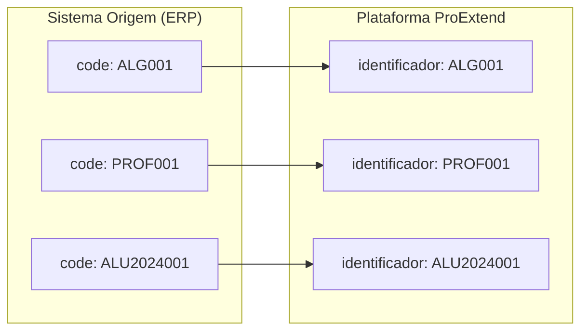
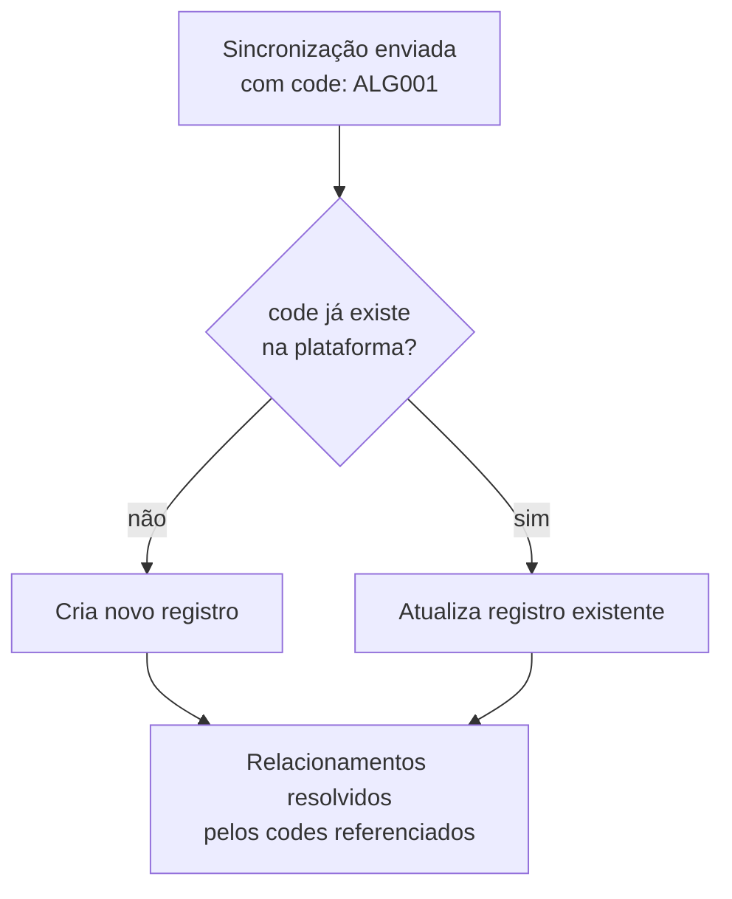
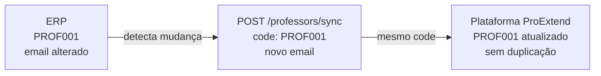

# Identificadores e codes

## Introdução

Este documento especifica o sistema de identificação de entidades na API de Integração ProExtend, detalhando o uso de `codes` (identificadores próprios do sistema de origem), comportamento idempotente, convenções e casos de uso práticos.

## Conceito Principal

**A API utiliza identificadores do sistema de origem (`codes`)**. A plataforma ProExtend não gera novos identificadores através da API de integração.

### Fluxo de Identificação



Esta abordagem elimina a necessidade de mapeamento entre sistemas e simplifica a integração.

## O que é um Code

Um **code** é o identificador único definido no sistema de origem e enviado para a plataforma.

### Exemplos Práticos

**Unidades**:
- `"CAMPUS_CENTRO"`, `"SEDE"`, `"FILIAL_01"`

**Disciplinas**:
- `"ALG001"`, `"BD001"`, `"LIBRAS"`, `"MAT101"`

**Professores**:
- `"PROF001"` (matrícula)
- `"12345678901"` (CPF)
- `"JOS001"` (código funcional)

**Alunos**:
- `"ALU2024001"` (matrícula)
- `"98765432100"` (CPF)
- `"20241234"` (RA)

**Turmas**:
- `"ALG001-2025.1"` (disciplina + semestre)
- `"TURMA001"` (código único)

## Como funcionam os codes

Ao enviar um `code` pela primeira vez, a plataforma cria o registro. Nas sincronizações seguintes com o mesmo `code`, os dados são atualizados. Para vincular entidades, basta referenciar o `code` de cada uma nos campos correspondentes.



## Diretrizes e Boas Práticas

| Diretriz | Bom | Ruim |
|---|---|---|
| **Consistência de formato** | `ALG001`, `ALG002`, `BD001` | `alg1`, `Alg-002`, `bd_001` |
| **Significado semântico** | `CAMPUS_CENTRO`, `ALG001` | `C1`, `C2`, `D1` |
| **Unicidade por tipo** | `PROF001` único entre professores | dois professores com `PROF001` |
| **Estabilidade** | matrícula nunca muda: `PROF001` | `PROF-2024-001` → `PROF-2025-001` |

:::note
`codes` podem ser idênticos entre tipos diferentes de entidades sem conflito. Um professor e um aluno podem ter `code: "001"` pois são escopos separados.
:::

## Exemplos Práticos

### Exemplo 1: Sincronizar Disciplina

**ERP da Instituição**, tabela `disciplinas`:

| id | codigo | nome |
|----|--------|------|
| 1 | `ALG001` | Algoritmos I |
| 2 | `BD001` | Banco de Dados I |

**Enviar para API**:
```json
{
  "subjects": [
    {
      "code": "ALG001",
      "name": "Algoritmos I"
    },
    {
      "code": "BD001",
      "name": "Banco de Dados I"
    }
  ]
}
```

Disciplinas são entidades globais da instituição e não exigem `course_code`. O vínculo curso ↔ disciplina é feito na Turma via `course_codes`. Consulte [Conceitos Fundamentais](conceitos-fundamentais).

**Não é necessário** armazenar nada além do que já tem no ERP.

### Exemplo 2: Sincronizar Turma

**ERP da Instituição**, tabela `turmas`:

| id | codigo | disciplina | professor | semestre |
|----|--------|------------|-----------|----------|
| 10 | `ALG001-25.1` | `ALG001` | `PROF001` | 2025.1 |

Tabela `matriculas`:

| turma | aluno |
|-------|-------|
| 10 | `ALU001` |
| 10 | `ALU002` |

**Enviar para API**:
```json
{
  "enrollments": [
    {
      "code": "ALG001-25.1",
      "subject_code": "ALG001",
      "course_codes": ["CC001"],
      "professor_codes": ["PROF001"],
      "semester": "2025.1",
      "student_codes": ["ALU001", "ALU002"]
    }
  ]
}
```

O campo `course_codes` é **obrigatório** na Turma. É onde o vínculo curso ↔ disciplina é definido. Utilize os códigos existentes no sistema!

### Exemplo 3: Atualizar Professor

Quando um dado muda no ERP, basta sincronizar novamente com o mesmo `code`. A plataforma reconhece o identificador e atualiza o registro existente.



## Aluno com múltiplas matrículas

A integração suporta o caso de um mesmo usuário (aluno) ter **duas ou mais matrículas ativas** em cursos diferentes (cenário comum em instituições com dupla diplomação ou matrícula simultânea).

Cada matrícula é sincronizada como um aluno independente, com:

- `code` único por matrícula
- `email` igual ao do usuário (aluno) (compartilhado entre as matrículas)
- `cpf` igual ao do usuário (aluno) (compartilhado entre as matrículas)
- `course_code` do curso da matrícula em questão

```json
{
  "students": [
    {
      "code": "MAT-CC-2024001",
      "name": "João da Silva",
      "email": "joao.silva@email.com",
      "cpf": "12345678901",
      "course_code": "CC001"
    },
    {
      "code": "MAT-ES-2024001",
      "name": "João da Silva",
      "email": "joao.silva@email.com",
      "cpf": "12345678901",
      "course_code": "ES001"
    }
  ]
}
```

A integração cria dois usuários distintos na plataforma, cada um vinculado à sua matrícula. Notas, frequência, submissões e histórico ficam **independentes por matrícula**.

### Login do aluno com múltiplas matrículas

- **Recomendado (SSO)**: gere o token via `POST /sso/generate-token` informando o `user_code` da matrícula específica. A plataforma identifica corretamente qual matrícula acessar.
- **Login tradicional (email/senha)**: não é suportado quando há múltiplas matrículas para o mesmo usuário (aluno). Use SSO.

:::note
A restrição de e-mail único na plataforma se aplica apenas a **perfis administrativos** (professor, coordenador, gestor de área, diretor, assessor pedagógico, administrador). Para alunos, e-mail e CPF podem se repetir entre matrículas distintas (mesmo `code` continua único).
:::

## Códigos Flexíveis

O campo `code` aceita qualquer identificador único do sistema de origem. A escolha do formato fica a critério da instituição, desde que mantida consistência.

| Entidade | Formatos aceitos | Exemplos |
|---|---|---|
| Professor | Matrícula, CPF, código funcional | `"PROF001"`, `"12345678901"`, `"JOS001"` |
| Aluno | Matrícula, CPF, RA | `"ALU2024001"`, `"98765432100"`, `"20241234"` |
| Turma | Livre (recomenda-se incluir semestre) | `"ALG001-2025.1"`, `"CC001-ALG001-2025.1"` |

## Erros Comuns

<Accordion>

<AccordionItem value="erro-1" title="Erro 1: Code Duplicado em Criação Inicial">

**Problema**:
```json
{
  "professors": [
    { "code": "PROF001", "name": "João", "email": "joao@f.br", "cpf": "111" },
    { "code": "PROF001", "name": "Maria", "email": "maria@f.br", "cpf": "222" }
  ]
}
```

**Erro**: Email duplicado (porque code duplicado tenta atualizar)

**Solução**: `codes` únicos
```json
{
  "professors": [
    { "code": "PROF001", "name": "João", "email": "joao@f.br", "cpf": "111" },
    { "code": "PROF002", "name": "Maria", "email": "maria@f.br", "cpf": "222" }
  ]
}
```

</AccordionItem>

<AccordionItem value="erro-2" title="Erro 2: Referência a Code Inexistente">

**Problema**:
```json
{
  "enrollments": [
    {
      "code": "TURMA001",
      "subject_code": "ALG999",
      "course_codes": ["CC001"],
      "professor_codes": ["PROF001"],
      "semester": "2025.1",
      "student_codes": []
    }
  ]
}
```

**Resposta da API** (`422`, nenhum item persistido):
```json
{
  "success": false,
  "created": 0,
  "updated": 0,
  "failed": 1,
  "errors": [
    {
      "index": 0,
      "code": "TURMA001",
      "errors": [
        {
          "type": "code_not_found",
          "message": "Disciplina 'ALG999' não encontrada(o).",
          "entity": "subject",
          "code": "ALG999"
        }
      ]
    }
  ]
}
```

**Solução**: Sincronize disciplinas primeiro
```
1. Sincronizar disciplina ALG999
2. Depois sincronizar turma que usa ALG999
```

Detalhes do shape `ApiError` em [Tratamento de Erros](tratamento-de-erros).

</AccordionItem>

<AccordionItem value="erro-3" title="Erro 3: Code Inválido (Vazio ou Nulo)">

**Problema**:
```json
{
  "subjects": [
    { "code": "", "name": "Algoritmos" }
  ]
}
```

**Erro**: Code é obrigatório

**Solução**: Sempre forneça code válido
```json
{
  "subjects": [
    { "code": "ALG001", "name": "Algoritmos" }
  ]
}
```

</AccordionItem>

</Accordion>

## Resumo Executivo

### Princípios Fundamentais

1. **Códigos próprios**: utilize identificadores do sistema de origem
2. **Idempotência**: Mesmo code atualiza registro existente ao invés de duplicar
3. **Relacionamentos**: Vínculo entre entidades através de codes
4. **Independência**: Não requer armazenamento de IDs internos da plataforma
5. **Estabilidade**: Mantenha padrão consistente e evite alterações desnecessárias

### Checklist de Implementação

- [ ] Definir padrão de nomenclatura de codes por tipo de entidade
- [ ] Garantir unicidade de codes dentro de cada tipo
- [ ] Validar existência de codes referenciados antes de sincronizar
- [ ] Implementar mecanismo de geração consistente de codes
- [ ] Documentar convenções adotadas para equipe
