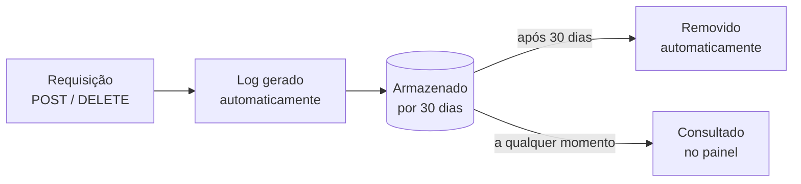

# Logs de Integrações

Toda requisição de escrita feita pela API é registrada automaticamente como um log de integração. Esses registros permitem acompanhar o histórico de sincronizações, identificar falhas e auditar o uso da integração.

## Como acessar os logs

Os logs podem ser acessados de duas formas:

- **Plataforma ProExtend:** acesse em Avançado > Integrações para visualizar e filtrar os logs diretamente no painel administrativo.
- **API de Integração:** consuma os endpoints `GET /sync-logs` e `GET /sync-logs/{id}` para integrar os logs a ferramentas externas como dashboards, sistemas de monitoramento ou planilhas.

:::info
Os endpoints de logs estão disponíveis para consulta na API de integração. Para detalhes de parâmetros e resposta, acesse a documentação da API.

**<a href="/api" target="_blank">Acessar API →</a>**
:::

## Operações registradas

Um log é gerado automaticamente a cada requisição de escrita. Requisições de leitura (`GET`) não geram log.

| Operação | Descrição | Endpoint |
|---|---|---|
| Sincronização | Criação e atualização de entidades | `POST /{entidade}/sync` |
| Remoção | Exclusão de registros | `DELETE /{entidade}/{code}` |
| Matrícula | Vínculo e desvinculo de alunos em turmas | `POST /enrollments/{code}/students/{studentCode}` |
| SSO | Geração e revogação de tokens de acesso | `POST /sso/generate-token`, `POST /sso/revoke-token` |

## Retenção dos logs

Cada log é armazenado com base na sua **data de criação** e fica disponível por 30 dias corridos, após os quais é removido automaticamente.



```
Log criado em:   2026-05-01
Disponível até:  2026-05-31  ✓
Removido em:     2026-06-01  ✗
```

```
Log criado em:   2026-05-15
Disponível até:  2026-06-14  ✓
Removido em:     2026-06-15  ✗
```

## Como filtrar os logs

Tanto no painel quanto na API, os logs podem ser filtrados pelos critérios abaixo. Combine vários filtros para reduzir o resultado (por exemplo, falhas de sincronização de alunos em um período).

| Filtro | Descrição | Exemplo |
|---|---|---|
| Chave de integração | Restringe aos logs de uma API Key específica | `pex_a1b2c3...` |
| Entidade | Tipo de entidade da operação | `professors`, `students`, `enrollments` |
| Método | Verbo HTTP da requisição | `POST`, `DELETE` |
| Status | Resultado da operação | `sucesso` ou `erro` |
| Período | Intervalo de datas de criação do log | `2026-05-01` a `2026-05-31` |

:::info
Os nomes exatos dos parâmetros de query (`GET /sync-logs`) e os valores aceitos estão documentados no playground interativo, onde é possível montar e testar a requisição.

**<a href="/api" target="_blank">Acessar API →</a>**
:::

## Exemplos de resposta

<Accordion>

<AccordionItem value="sucesso" title="Sync com sucesso">

```json
{
  "action": "Sync professors: 3 criados, 1 atualizado",
  "status": 200,
  "success": true,
  "result": { "created": 3, "updated": 1, "failed": 0 }
}
```

</AccordionItem>

<AccordionItem value="rejeitado" title="Sync com validação rejeitada (422)">

```json
{
  "action": "Sync students (falhou)",
  "status": 422,
  "success": false,
  "error": "O código do curso é obrigatório."
}
```

</AccordionItem>

<AccordionItem value="parcial" title="Sync com falha parcial em item (200)">

```json
{
  "action": "Sync enrollments: 1 criados, 1 falharam",
  "status": 200,
  "success": true,
  "result": {
    "created": 1,
    "updated": 0,
    "failed": 1,
    "errors": [
      {
        "index": 1,
        "code": "ALG001-2025.1",
        "errors": [
          {
            "type": "code_not_found",
            "message": "Professor 'PROF999' não encontrado(a).",
            "entity": "professor",
            "code": "PROF999"
          }
        ]
      }
    ]
  }
}
```

O campo `result` preserva o shape `ApiError` completo para cada item de falha, permitindo filtrar logs por `entity`, `type` ou `rule` programaticamente. Detalhes em [Tratamento de Erros](tratamento-de-erros).

</AccordionItem>

<AccordionItem value="sso" title="SSO">

```json
{
  "action": "SSO: gerou token para João Silva",
  "status": 200,
  "success": true,
  "result": { "user_name": "João Silva", "profile_type": "professor" }
}
```

</AccordionItem>

</Accordion>

:::note Dados sensíveis
Campos como `cpf`, `password` e `api_key` são substituídos por `[REDACTED]` antes de ser armazenados.
:::
