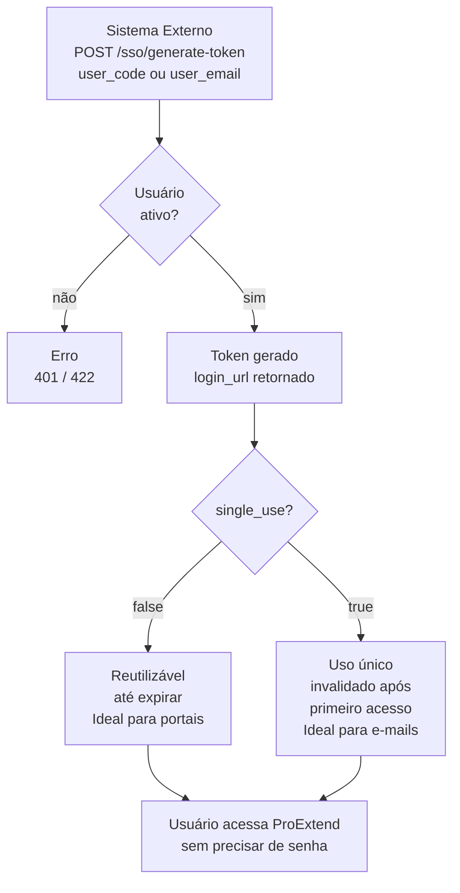

# SSO (Single Sign-On)

## Introdução

A funcionalidade SSO (Single Sign-On - Login Único) permite que sistemas externos gerem tokens de acesso para login direto de usuários na plataforma ProExtend sem necessidade de credenciais.

### Casos de Uso

**Portais Institucionais**  
Adicione links diretos de acesso ao ProExtend no portal da sua instituição.

**Convites e E-mails**  
Envie links de acesso temporário para novos usuários ou ações específicas.

**Suporte Técnico**  
Gere acessos temporários para equipes de suporte realizarem manutenções.

**Sistemas Integrados**  
Conecte sistemas acadêmicos ao ProExtend de forma simples.

## Fluxo de Autenticação

O processo de autenticação SSO segue os seguintes passos:



## Gerar Token SSO

### Endpoint

<ApiEndpoint method="POST" path="/integration/v1/sso/generate-token" />

### Parâmetros

O usuário é identificado por **email** ou **code**. É obrigatório fornecer pelo menos um dos dois.

| Campo | Tipo | Obrigatório | Descrição |
|-------|------|-------------|-----------|
| `user_email` | string | Condicional | E-mail do usuário (obrigatório se `user_code` não fornecido) |
| `user_code` | string | Condicional | Código do usuário (obrigatório se `user_email` não fornecido) |
| `expires_in` | integer | Não | Tempo de expiração em segundos - padrão: 86400 (24 horas) |
| `single_use` | boolean | Não | Token de uso único - padrão: false (reutilizável) |

Para alunos com mais de uma matrícula ativa em cursos diferentes (cada matrícula é um aluno distinto com `code` próprio), use sempre `user_code`, pois o `user_email` não identifica qual matrícula acessar. Veja [Aluno com múltiplas matrículas](identificadores-e-codes#aluno-com-múltiplas-matrículas).

#### expires_in (Tempo de Expiração)

Define por quanto tempo o token permanece válido. Mínimo `60` (1 min), máximo `31536000` (365 dias), padrão `86400` (24 horas).

Valores comuns:

| Valor | Duração | Uso |
|-------|---------|-----|
| `900` | 15 minutos | Acesso temporário urgente |
| `3600` | 1 hora | Suporte técnico |
| `86400` | 24 horas | Acesso padrão |
| `604800` | 7 dias | Convites de primeiro acesso |
| `2592000` | 30 dias | Acesso de longa duração |
| `15552000` | 180 dias | Portal institucional / semestre |

#### single_use (Uso Único)

Define se o token pode ser usado uma vez ou múltiplas vezes.

- `true`: invalidado após o primeiro uso. Ideal para links em e-mails e convites.
- `false` (padrão): permanece válido até expirar. O link gerado pode ser cadastrado em portais e acessado recorrentemente durante todo o `expires_in`. Por exemplo, `15552000` (180 dias) cobre um semestre inteiro.

:::warning[Segurança]
Para links enviados por e-mail ou convites de primeiro acesso, use `single_use: true` para que o token não possa ser reutilizado caso seja interceptado.
:::

### Exemplo de Requisição

```json
{
  "user_code": "PROF001",
  "expires_in": 604800,
  "single_use": false
}
```

### Resposta de Sucesso

```json
{
  "success": true,
  "message": "Token SSO gerado com sucesso.",
  "data": {
    "login_url": "https://{{instituicao}}.proextend.com.br/login?token=TbbVa3x8KlMnPqRsUvWxYz...",
    "user": {
      "name": "Dr. João Silva",
      "profile_type": "professor"
    }
  }
}
```

O campo `profile_type` reflete o perfil do usuário na plataforma: `professor`, `student`, `coordinator`, `area_manager`, `director` ou `pedagogical_advisor`.

Basta informar o `user_code` ou `user_email`: o sistema identifica automaticamente o perfil e gera a `login_url` apontando para o ambiente correto, sem configuração adicional.

## Revogar Token SSO

Revoga tokens SSO de um usuário específico.

:::info[AUTO-REVOGAÇÃO]
Ao gerar um novo token SSO para um usuário, **todos os tokens anteriores deste usuário são automaticamente revogados**. Isso garante que apenas um token esteja ativo por vez, aumentando a segurança.
:::

### Endpoint

<ApiEndpoint method="POST" path="/integration/v1/sso/revoke-token" />

### Parâmetros

| Campo | Tipo | Obrigatório | Descrição |
|-------|------|-------------|-----------|
| `user_email` | string | Condicional | E-mail do usuário (obrigatório se `user_code` não fornecido) |
| `user_code` | string | Condicional | Código do usuário (obrigatório se `user_email` não fornecido) |
| `revoke_all` | boolean | Não | true = revoga todos tokens ativos (padrão) / false = revoga apenas expirados |

### Exemplo de Requisição

```json
{
  "user_code": "PROF001",
  "revoke_all": true
}
```

### Resposta de Sucesso

```json
{
  "success": true,
  "message": "Todos os tokens do usuário foram revogados.",
  "data": {
    "revoked_count": 3,
    "user": {
      "name": "Dr. João Silva",
      "email": "professor@faculdade.edu.br",
      "profile_type": "professor"
    }
  }
}
```

## Casos de Uso Práticos

<Tabs items={[
  {value: 'portal', label: 'Portal Institucional'},
  {value: 'email', label: 'E-mail de Convite'},
  {value: 'temporario', label: 'Acesso Temporário'},
]}>

<Tab value="portal">

Link permanente no portal da instituição.

**Configuração**:
```json
{
  "user_code": "PROF001",
  "expires_in": 15552000,
  "single_use": false
}
```

**Características**:
- Expira em 180 dias (1 semestre)
- Token reutilizável
- Ideal para acesso recorrente

</Tab>

<Tab value="email">

Link temporário para primeiro acesso.

**Configuração**:
```json
{
  "user_email": "novoprofessor@faculdade.edu.br",
  "expires_in": 604800,
  "single_use": true
}
```

**Características**:
- Expira em 7 dias
- Uso único
- Ideal para novos usuários

</Tab>

<Tab value="temporario">

Acesso para manutenção ou suporte.

**Configuração**:
```json
{
  "user_code": "ADMIN001",
  "expires_in": 900,
  "single_use": true
}
```

**Características**:
- Expira em 15 minutos
- Uso único
- Ideal para suporte técnico

</Tab>

</Tabs>

## Tratamento de Erros

Todos os erros seguem o shape padronizado `ApiError`. Para detalhes do shape e estratégias de tratamento, consulte [Tratamento de Erros](tratamento-de-erros).

### Usuário Não Encontrado (404)

```json
{
  "success": false,
  "message": "Usuário 'PROF999' não encontrado(a).",
  "errors": [
    {
      "type": "code_not_found",
      "message": "Usuário 'PROF999' não encontrado(a).",
      "entity": "user",
      "code": "PROF999"
    }
  ]
}
```

### Usuário Suspenso (422)

```json
{
  "success": false,
  "message": "O usuário está suspenso e não pode gerar token SSO.",
  "errors": [
    {
      "type": "constraint_violation",
      "message": "O usuário está suspenso e não pode gerar token SSO.",
      "entity": "user",
      "rule": "user_suspended"
    }
  ]
}
```

Apenas usuários ativos podem gerar tokens SSO. Usuários suspensos (`suspended_at` não nulo) ficam bloqueados até que a suspensão seja removida.

### Parâmetro Inválido (422)

```json
{
  "success": false,
  "message": "Dados inválidos.",
  "errors": [
    {
      "type": "validation_failed",
      "message": "O tempo mínimo de expiração é 60 segundos.",
      "field": "expires_in"
    }
  ]
}
```

### Identificador Ausente (422)

Quando nem `user_code` nem `user_email` são informados, o `errors[]` traz um item por campo obrigatório:

```json
{
  "success": false,
  "message": "Dados inválidos.",
  "errors": [
    {
      "type": "validation_failed",
      "message": "O e-mail ou código do usuário é obrigatório.",
      "field": "user_email"
    },
    {
      "type": "validation_failed",
      "message": "O código ou e-mail do usuário é obrigatório.",
      "field": "user_code"
    }
  ]
}
```

## Boas Práticas de Segurança

### Tempos de Expiração

Utilize tempos de expiração adequados ao contexto de uso:

**Curtos (15min-1h)**  
Para acessos sensíveis e suporte técnico.

**Médios (1-7 dias)**  
Para convites e primeiro acesso.

**Longos (30-180 dias)**  
Para portais institucionais ou períodos semestrais.

### Tokens de Uso Único

Prefira `single_use: true` para links enviados por e-mail.

### Limite de Validade

Evite tokens com validade superior a 180 dias.
