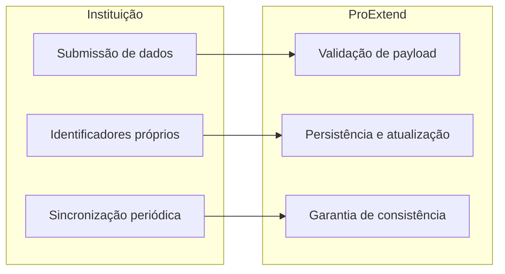

# Visão Geral da Integração

## Objetivo da Integração

A API de Integração ProExtend permite que sistemas de gestão acadêmica (ERPs) sincronizem dados com a plataforma ProExtend. Esta API possibilita a sincronização bidirecional de dados acadêmicos incluindo unidades, áreas, cursos, disciplinas, professores, alunos e matrículas.

## Arquitetura de Comunicação



### Características Arquiteturais

1. **Sistema de identificação baseado em codes**: utiliza identificadores do sistema de origem
2. **Operações Idempotentes**: Sincronizações múltiplas não resultam em duplicação de dados
3. **Arquitetura RESTful**: Protocolo HTTP com payloads JSON
4. **Autenticação via API Key**: Credenciais de longa duração geradas administrativamente

## Mecanismo de Autenticação

A API implementa autenticação baseada em API Keys geradas através do painel administrativo (Avançado > Integrações).

## Sistema de identificadores (codes)

O sistema utiliza identificadores próprios do ERP de origem (denominados `codes`) para todas as entidades. A API ProExtend não gera novos identificadores.

O mapeamento de entidades é realizado exclusivamente através dos codes fornecidos. Não é necessário armazenar IDs internos da plataforma.

A API possui comportamento idempotente: ao sincronizar uma entidade cujo code já existe, os dados são atualizados sem criar registros duplicados.

Especificação detalhada em [Identificadores e codes](identificadores-e-codes).

## Modelo de Dados

O sistema opera com as seguintes entidades:

### 1. Unidades (Units)
Representam campus ou unidades físicas da instituição de ensino.

Exemplo: Campus Centro, Campus Norte

### 2. Diretores (Directors)
Diretores de unidade/campus. Vinculados a uma unidade específica.

Exemplo: Roberto Lima (Campus Centro), Carla Neves (Campus Norte)

### 3. Assessores Pedagógicos (Pedagogical Advisors)
Assessores de apoio pedagógico. Vinculados a uma unidade específica.

Exemplo: Fernanda Costa (Campus Centro)

### 4. Áreas (Areas)
Áreas de conhecimento que agrupam cursos relacionados.

Exemplo: Tecnologia da Informação, Ciências da Saúde

### 5. Gestores de Área (Area Managers)
Gestores responsáveis por áreas de conhecimento. Vinculados a uma área específica.

Exemplo: Carlos Mendes (Tecnologia da Informação)

### 6. Cursos (Courses)
Programas acadêmicos oferecidos pela instituição.

Exemplo: Ciência da Computação, Enfermagem

### 7. Coordenadores (Coordinators)
Coordenadores de curso com acesso ao painel ProExtend. Vinculados a um curso específico.

Exemplo: Prof. Ana Souza (Ciência da Computação)

### 8. Disciplinas Base (Subjects)
Componentes curriculares que compõem a grade de cursos.

Exemplo: Algoritmos I, Banco de Dados, LIBRAS

:::note
Disciplinas Base representam o cadastro curricular permanente, sem vínculo com períodos letivos ou discentes.
:::

### 9. Turmas (Enrollments)
Instâncias de disciplinas base vinculadas a período letivo específico, incluindo um ou mais docentes responsáveis e discentes matriculados. Suportam múltiplos cursos via `course_codes`.

Exemplo: Turma "Algoritmos I - 2025.1" ministrada pelo Prof. João Silva e Prof. Maria Santos, com 30 alunos dos cursos de Ciência da Computação e Sistemas de Informação

:::note
Turmas são instâncias de Disciplinas Base em um período letivo. Um aluno pode ser matriculado se pertencer ao curso da disciplina base ou a qualquer curso adicional vinculado via `course_codes`.
:::

### 10. Professores (Professors)
Docentes responsáveis por ministrar disciplinas na instituição.

Exemplo: Dr. João Silva, professor da área de Tecnologia da Informação, ministra as turmas de Algoritmos I e Banco de Dados no semestre 2025.1

### 11. Alunos (Students)
Discentes matriculados em programas acadêmicos.

Exemplo: Pedro Oliveira, aluno do curso de Ciência da Computação, matriculado nas turmas de Algoritmos I e Banco de Dados no semestre 2025.1

### 12. Administradores (Admins)

Gestores da instituição com acesso completo ao painel ProExtend. Responsáveis por criar integrações, fazer alterações manuais em turmas e gerenciar outras entidades diretamente pela plataforma.

:::note
Administradores **não são criados via integração**. São cadastrados e gerenciados pelo próprio painel ProExtend.
:::

## Distinção: Disciplina Base vs Turma

- **Disciplina Base (Subject)**: Registro permanente no catálogo curricular, sem vínculo temporal ou matrícula de alunos
- **Turma (Enrollment)**: Instância de disciplina base em período letivo determinado, com docente e discentes vinculados

Detalhamento em [Conceitos Fundamentais](conceitos-fundamentais).

## Processo de Integração


Especificação detalhada em [Fluxo de Sincronização](fluxo-de-sincronizacao).

## Operações Suportadas

### Operações de Consulta (GET)

Recuperação de dados sincronizados.

Permissão requerida: scope `read` ou `full`

Exemplos:
- `GET /integration/v1/units` - Listagem de unidades
- `GET /integration/v1/professors/PROF001` - Recuperação de professor por identificador

### Operações de Sincronização (POST)

Criação ou atualização de entidades em lote.

Permissão requerida: scope `write` ou `full`

Exemplos:
- `POST /integration/v1/units/sync` - Sincronização de unidades
- `POST /integration/v1/students/sync` - Sincronização de alunos

Comportamento de sincronização:
- Entidade com code existente: atualização de dados
- Entidade com code inexistente: criação de novo registro
- Operação idempotente: execução múltipla não resulta em duplicação

### Operações de Remoção (DELETE)

Remoção de entidades por code.

Permissão requerida: scope `write` ou `full`

Exemplos:
- `DELETE /integration/v1/units/{code}` - Remove unidade e entidades dependentes
- `DELETE /integration/v1/professors/{code}` - Remove professor

Todas as remoções são soft delete. Entidades pai removem filhos em cascata. Consulte [Remoção de Entidades](remocao) para detalhes.

## Segurança e Controle de Acesso

### Escopos de Autorização

Cada API Key é configurada com escopo de acesso específico:

- **read**: Permissão de leitura (endpoints GET)
- **write**: Permissão de sincronização (endpoints POST /sync)
- **full**: Permissão completa (leitura e escrita)

### Limitação de Taxa (Rate Limiting)

Limite configurável por cliente API (padrão: 60 requisições/minuto).

Resposta em caso de excedente de taxa:

```json
{
  "success": false,
  "message": "Muitas tentativas. Por favor, tente novamente mais tarde.",
  "retry_after": 60,
  "status": 429
}
```

### Requisitos de Segurança

- **Protocolo HTTPS**: Obrigatório para todas as requisições
- **Isolamento de Dados**: Cada instituição acessa exclusivamente seus próprios dados
- **Credenciais Exclusivas**: API Keys únicas por integração

## Especificação de Endpoints

### URL Base

```
https://{{instituicao}}.proextend.com.br/api/integration/v1/
```

Substituir `{{instituicao}}` pela URL fornecida para sua instituição.


## Exemplo de Utilização

```bash
# Sincronização de professor
POST /integration/v1/professors/sync
Authorization: Bearer pex_...

{
  "professors": [{
    "code": "PROF001",
    "name": "Dr. João Silva",
    "email": "joao@inst.edu.br",
    "cpf": "12345678901"
  }]
}

# Consulta de professor
GET /integration/v1/professors/PROF001
Authorization: Bearer pex_...
```

Exemplos completos em [Fluxo de Sincronização](fluxo-de-sincronizacao).

## Características da Solução

1. **Independência de identificadores internos**: utilização de códigos do sistema de origem
2. **Operações Idempotentes**: Sincronizações múltiplas sem efeitos colaterais
3. **Sincronização Seletiva**: Possibilidade de sincronizar subconjuntos de entidades
4. **Rastreabilidade**: vinculação de dados através de identificadores do sistema de origem

## Próximas Etapas

Para implementação da integração:

1. Revisar [Conceitos Fundamentais](conceitos-fundamentais) para compreensão do modelo de dados
2. Configurar [Autenticação](autenticacao) para obtenção de credenciais
3. Implementar [Fluxo de Sincronização](fluxo-de-sincronizacao) conforme sequência especificada
4. Aplicar diretrizes de [Identificadores e codes](identificadores-e-codes)
5. Monitorar operações via [Logs de Integrações](logs-de-integracoes)
6. (Opcional) Implementar [SSO](sso) para login direto de usuários

## Recursos de Monitoramento

- **Health Check**: `GET /integration/v1/health`. Endpoint público sem autenticação. Retorna status da API, versão e tempo de resposta. Útil para verificar disponibilidade antes de sincronizar.
- **Sync Status**: `GET /integration/v1/sync-status`. Retorna contagem de entidades sincronizadas e informações da última sincronização da chave em uso.
- **Logs de Integrações**: toda requisição de escrita é registrada automaticamente com status, ação e detalhes da resposta. Os logs ficam disponíveis por 30 dias no painel e via API. Consulte [Logs de Integrações](logs-de-integracoes).
